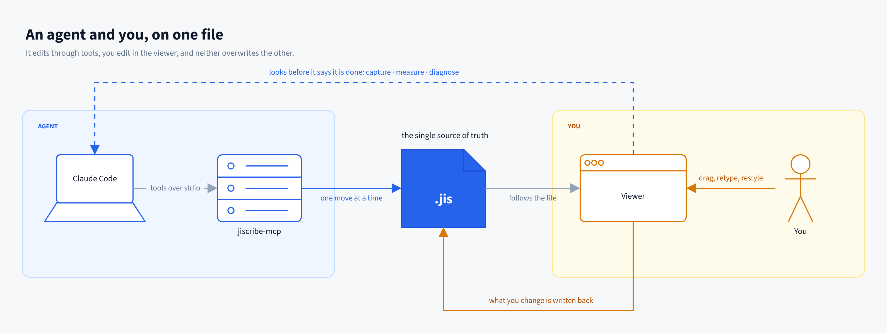
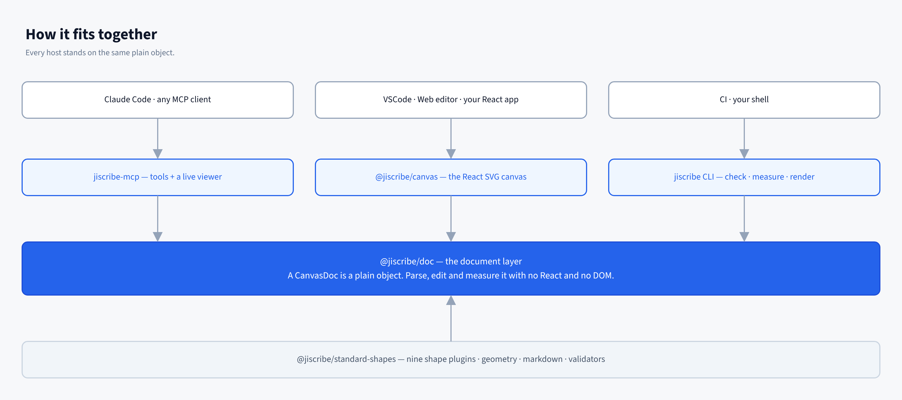

> 🌐 English version: [README.md](./README.md)

# Jiscribe

人と AI が一緒に描く SVG キャンバス。図もモックもポスターも、文書そのものも。


AI が描き、人が手で直し、AI がその続きを描く。作り直しにはならず、直した箇所も
消えない。描いたものはコード上では**ただのオブジェクト**、保存すれば**ただの JSON**
（`.jis`）で、キャンバスはそれを編集する手段の 1 つ、AI のツールはもう 1 つの
手段にすぎないからだ。

作図に必要なものは一式そろっている。コアが 8 つの基本型（`rect` / `ellipse` /
`text` / `polyline` / `polygon` / `group` / `connector` / `svg`）を受け持ち、
フローチャート・UML・付箋・Markdown・コンテナ・注釈・汎用ピクトグラム・Lucide
アイコン・AWS アーキテクチャといった図形セットはプラグインとして同梱される。
プラグインが使う公開 API は、独自の図形を書くときに使うものとまったく同じである。

- **[Jiscribe Web](https://app.jiscribe.dev/)** — ブラウザで動くエディタ
- **[Jiscribe for VSCode](https://marketplace.visualstudio.com/items?itemName=gznnk.jiscribe)**
  — `.jis` を VSCode 上で開いて編集する拡張
- **[Jiscribe for Claude Code](./apps/claude-plugin)** — Claude Code 用プラグイン。
  中身は [`jiscribe-mcp`](https://www.npmjs.com/package/jiscribe-mcp) サーバー

## AI と一緒に使う前提で設計されている



- **1 手ずつ編集する。丸ごと作り直さない。** stdio 越しの 69 個のツールは、人が
  エディタでする操作と同じ単位である。追加・接続・整列・等間隔配置・グループ化・
  スタイル変更・重なり順・選択。編集はいまある文書に対して行われるので、人が手で
  置いたものはそのまま残り、`undo` が戻すのは AI 自身の操作だけである。
- **ゼロから作るときはファイルを直接書く。** 形式は小さく明示的で、基本型は 8 つ、
  プロパティは名前付き、座標はそのまま数値。だから AI は `.jis` を直接書けるし、
  200 ノードのグラフやアイソメトリックの格子のように配置するより計算した方が
  速いものは、スクリプトで生成できる。ツールは作図ガイドが、ファイルはフォーマット
  リファレンスが、それぞれ説明している。
- **完成と言う前に確かめる。** `validate` / `diagnose` / `measure` は Node 上で
  ヘッドレスに、エディタと同じレイアウトエンジンで動く。スキーマ違反、パースエラー、
  図形からはみ出したテキストを検出し、さらにキャンバスをキャプチャして目で見る。
  AI は、エディタが人に示すのと同じことを教えられる。
- **人と同時に開いていられる。** AI が書くファイルにローカルのビューアが追随し、
  そこで人が図形を動かせば書き戻される。AI が次にファイルを読めば、人の手が入った
  状態が見える。同じファイルへの書き込みは直列化され、AI の `undo` が人の編集を
  巻き戻すことはない。
- **フォーマットは仕様として定義されている。** JSON Schema と自動生成のリファレンスが
  図形セットと一緒に配布され、Claude Code のスキルも同じ図形マニフェストから生成される。
  AI に伝えている図形セットと、実際の図形セットがずれることがない。

## 何が作れるか

|                                                                                                                                                                                        |                                                                                                                                                                                           |
| -------------------------------------------------------------------------------------------------------------------------------------------------------------------------------------- | ----------------------------------------------------------------------------------------------------------------------------------------------------------------------------------------- |
| <br>**UML・クラス図** — パッケージ、インターフェース、コンポジション、多重度、ノート                    | <br>**アーキテクチャ図** — AWS のアイコンと境界のグループを、リージョンからサブネットまで               |
| <br>**正確な寸法のインフラ図** — 立体はすべて 30 度格子に沿ったネイティブなポリゴン | <br>**UI モック** — 取引端末: ローソク足・板・歩み値を、仕様書に使える精度で                                           |
| <br>**ポスター・印刷物** — タイポグラフィのグリッドも図形とテキストで組める                  | <br>**フロー図・スイムレーン** — 受け渡し・判断・例外系、そして各ステップが触るシステムを示すアイコン |


**1 枚のキャンバスに文書を丸ごと** — ポストモーテム: 数字・タイムライン・原因・アクション

このギャラリーの画像はどれも `.jis.png` である。書き出した画像に描画元の文書が埋め込まれているので、
画像を貼る場所ではただの画像として使え、VSCode 拡張で開けば元の文書として編集できる。
ダウンロードして、そのまま編集を続けてよい。`pnpm dev:examples` で起動する `apps/canvas-examples` のギャラリーも、
1 サンプル 1 ファイルで完結していて、そのまま自分のアプリにコピーできる。

## はじめかた

### AI から使う

Claude Code の場合:

```
/plugin marketplace add gznnk/jiscribe
/plugin install jiscribe
```

stdio 対応の MCP クライアントなら、次の設定で登録できる:

```jsonc
{
	"mcpServers": {
		"jiscribe": { "command": "npx", "args": ["-y", "jiscribe-mcp"] },
	},
}
```

必要なのは Node 22 以降だけである。npm パッケージにサーバー・ビューア・テキスト計測用の
フォントがすべて含まれている。ツールの一覧とビューアの挙動は [`apps/mcp`](./apps/mcp)
を参照。

### エディタで使う

[Jiscribe Web](https://app.jiscribe.dev/) は、アカウント登録もアップロードも無しに
ブラウザ上でキャンバスを開ける。ファイルは手元のマシンに置いたままである。
[Jiscribe for VSCode](https://marketplace.visualstudio.com/items?itemName=gznnk.jiscribe)
は `.jis` / `.jis.png` / `.jis.svg` をコードの隣で編集できるキャンバスとして開き、
診断結果を Problems パネルに表示する。

### シェルから使う

```bash
jiscribe validate <files...>   スキーマとパーサーで検査。エラーがあれば exit 1
jiscribe diagnose <files...>   validate に加えて、図形からはみ出したテキストを報告
jiscribe measure  <text>       指定した枠の中で文字列がどう折り返されるか
jiscribe render   <file>       文書を .png / .svg に描き出す
jiscribe preview  <file>       文書を、単体で表示できる HTML 1 枚に書き出す
```

CLI は、同じドキュメント層をコマンドラインから呼び出せるようにしたものである。
人も CI も AI も、1 つのファイルについて同じ検査結果を得られる。詳細は
[`apps/cli`](./apps/cli)。

## エンジンを組み込む

**現在使えるもの:** npm の `jiscribe-mcp`、VSCode 拡張、Jiscribe Web。

**準備中:** パッケージ本体。`@jiscribe/canvas` などはまだ npm に公開しておらず、
組み込み向けの API を整備している段階なので、公開 API は今後変わる可能性がある。
初回公開は GitHub Release として行うので、通知が欲しい場合はこのリポジトリを
Watch（Custom → Releases）しておくこと。現時点の API は次のような形である。

```tsx
import { Canvas } from "@jiscribe/canvas";
import type { CanvasDoc } from "@jiscribe/canvas";

const doc: CanvasDoc = { version: 1, root: [] };

export function App() {
	return <Canvas doc={doc} />;
}
```

プリミティブ以外の図形はプラグインから供給され、キャンバスごとに登録する。

```tsx
import { Canvas } from "@jiscribe/canvas";
import type { CanvasConfig } from "@jiscribe/canvas";
import { flowchartPlugin } from "@jiscribe/plugin-flowchart-shapes";
import { umlPlugin } from "@jiscribe/plugin-uml-shapes";

const config: CanvasConfig = { plugins: [flowchartPlugin, umlPlugin] };

export function App() {
	return <Canvas doc={doc} initialConfig={config} />;
}
```

**ドキュメント層は `@jiscribe/doc` という独立したパッケージ**になっている。React にも
DOM にも依存せずに `CanvasDoc` の解析・検証・編集・計測ができる層で、VSCode 拡張の
診断機能も CLI も AI 向けツールも、すべてこの層の上に作られている。キャンバスは不要で
文書の処理だけが必要なら、このパッケージだけを使えばよい。

## 全体の構成



| パッケージ                   | 内容                                                                                                      |
| ---------------------------- | --------------------------------------------------------------------------------------------------------- |
| `@jiscribe/canvas`           | エンジン本体。描画、ジェスチャー、コマンド、状態                                                          |
| `@jiscribe/doc`              | ヘッドレスなドキュメント層。`CanvasDoc` モデル・パーサー・編集 ops・`.jis.*` の入出力                     |
| `@jiscribe/canvas-sdk`       | プラグイン作者向けの図形オーサリングキット。canvas の公開 API だけで書かれている                          |
| `@jiscribe/geometry`         | 幾何型と幾何計算（矩形、楕円、変換、交差判定）                                                            |
| `@jiscribe/markdown`         | Markdown 図形が使う Markdown レンダリング                                                                 |
| `@jiscribe/basic-validators` | プリミティブの実行時バリデーター                                                                          |
| `@jiscribe/utility-types`    | 共有の TypeScript ユーティリティ型                                                                        |
| `@jiscribe/doc-schema`       | 標準図形セットから生成した JSON Schema・AI 向けリファレンス・Claude Code スキル                           |
| `@jiscribe/ai-tools`         | AI が呼べるキャンバスツールの宣言（トランスポート非依存）と、その適用                                     |
| `@jiscribe/standard-shapes`  | 出荷図形セットの正本（doc 面 / presentation 面の 2 エントリ）                                             |
| `@jiscribe/doc-tools`        | 標準セットに対する検証・計測・診断（Node 計測バックエンド込み）                                           |
| `plugins/*`                  | 標準の図形セット — flowchart、UML、container、general、annotation、sticky、markdown、Lucide アイコン、AWS |
| `apps/canvas-examples`       | 統合サンプル（1 サンプル = 1 ファイル）                                                                   |
| `apps/cli`                   | `jiscribe` コマンド。validate / diagnose / measure / render / preview                                     |
| `apps/mcp`                   | MCP サーバー。stdio でツールを提供し、ローカルにキャンバスビューアを立てる                                |
| `apps/claude-plugin`         | Claude Code プラグイン。MCP サーバーと、自動生成の作図スキル                                              |
| `apps/vscode-extension`      | Jiscribe の VSCode 拡張                                                                                   |

`plugins/` ディレクトリは意図的に*外部*として扱っている。これらのパッケージは
`@jiscribe/canvas`・`@jiscribe/doc`・`@jiscribe/canvas-sdk` の公開 API しか使えず、
それは ESLint で強制されている。標準の図形がその制約で書けるなら、あなたの図形も
書けるということである。

## 開発

```bash
pnpm install

pnpm dev:examples      # サンプルギャラリーを起動
pnpm build:examples    # サンプルギャラリーをビルド
pnpm build:vscode      # VSCode 拡張をビルド
pnpm build:mcp         # MCP サーバーとビューアをビルド
pnpm build:cli         # jiscribe コマンドをビルド

pnpm lint              # ワークスペース全体の ESLint
pnpm typecheck         # ワークスペース全体の TypeScript
pnpm dep:check         # 循環依存チェック（madge）
pnpm format            # Prettier
pnpm test              # ユニットテスト（vitest）
pnpm test:e2e          # Playwright の全スイート（コア・各プラグイン・同居検証）
```

必要環境: Node.js 22+ と pnpm 11。

エンジンの設計ドキュメントは
[`packages/canvas/docs/`](./packages/canvas/docs/README.ja.md) にある。設計思想、
アーキテクチャ、データモデル、ジェスチャーシステム、コマンドシステム、状態更新フロー、
外部同期、テーマ、テスト、スタイルプロパティ、図形設計、プラグインアーキテクチャ、
プラグイン作成の 13 本を収録している。英語版は同じ場所に `*.md` として置いてある。

## コントリビュート

**Issue は歓迎する。Pull Request は事前に合意したものだけ受け付ける** — まず Issue を
立て、その変更を入れたいという返答を待ってほしい。理由と、それ以外にマージまでに必要な
ことは [CONTRIBUTING.ja.md](./CONTRIBUTING.ja.md#コントリビュートの受け付け方) にある。

コード内コメントの多くと一部の設計ドキュメントは日本語で書かれているが、Issue と
Pull Request は英語でも構わない。

## 同梱している第三者の素材

AWS 図形セット（`plugins/aws-shapes`）は **AWS Architecture Icons** の図を同梱して
いる。これは Amazon Web Services, Inc. またはその関連会社の資産で、**下記の MIT
ライセンスは及ばない**。AWS の利用条件に従い、無改変・帰属表示付きで再配布している
ものなので、改変してはならない。詳細は
[`plugins/aws-shapes/LICENSE-ICONS.md`](./plugins/aws-shapes/LICENSE-ICONS.md)。

## ライセンス

[MIT](./LICENSE) © gznnk
