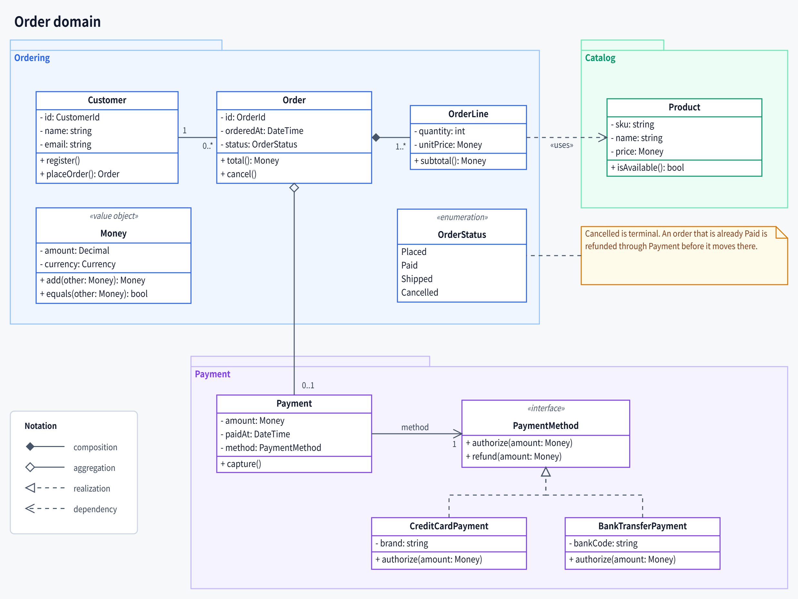
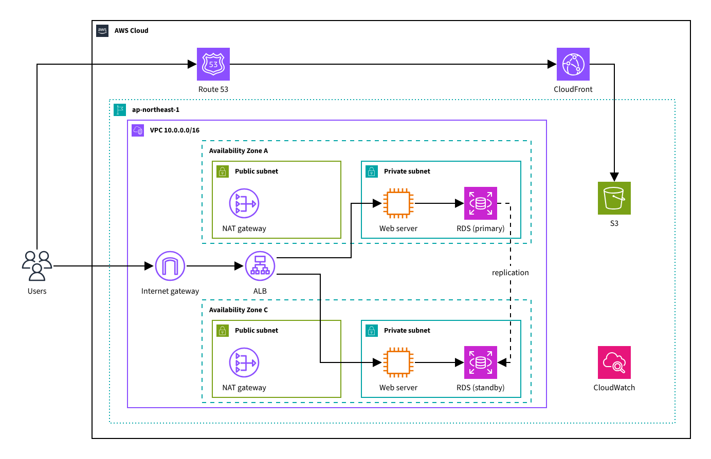
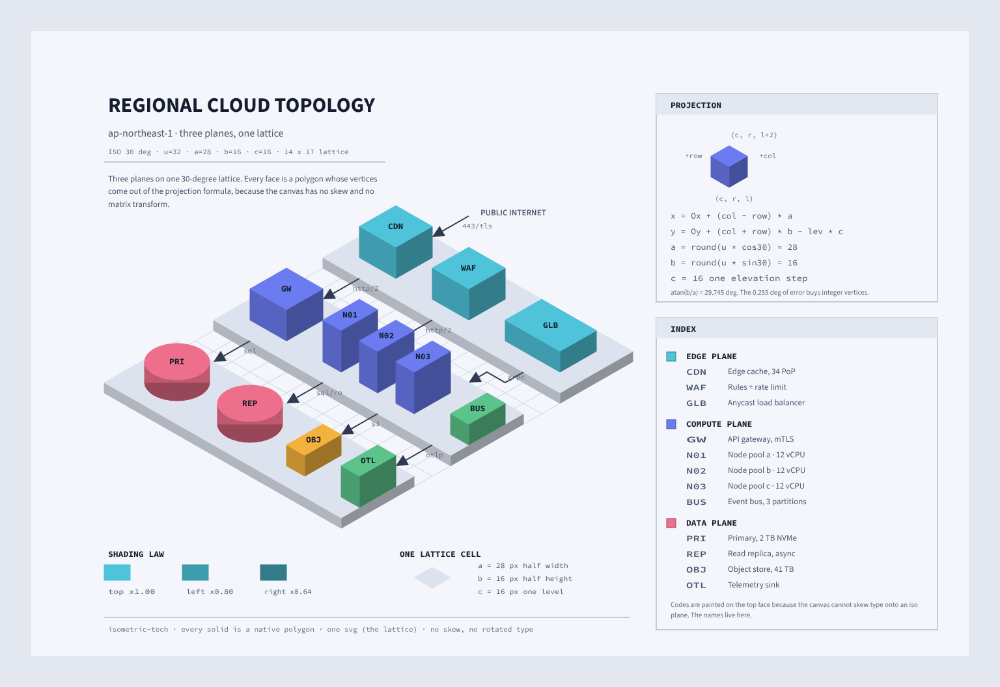
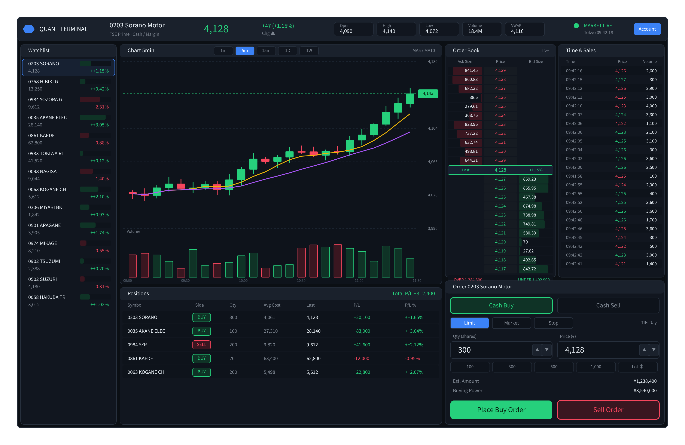
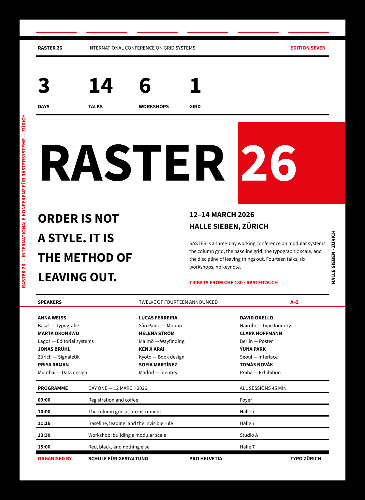
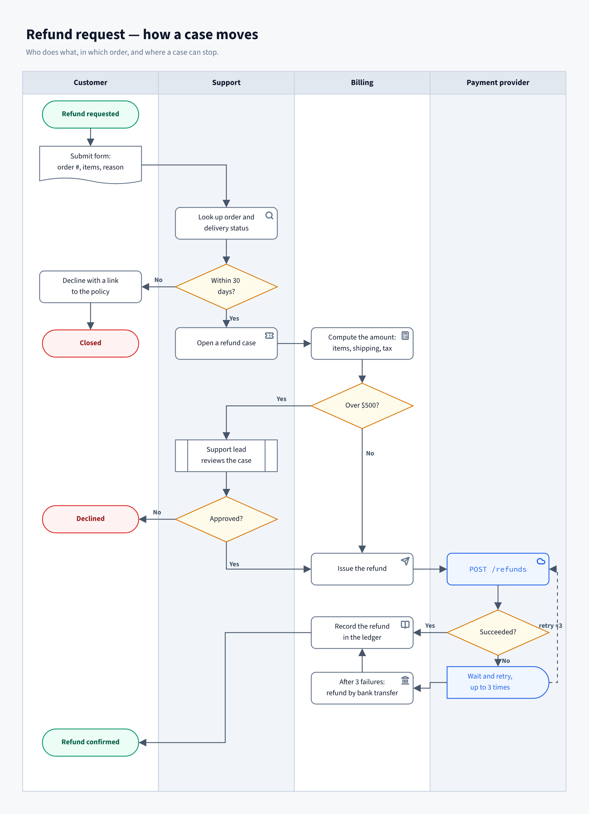
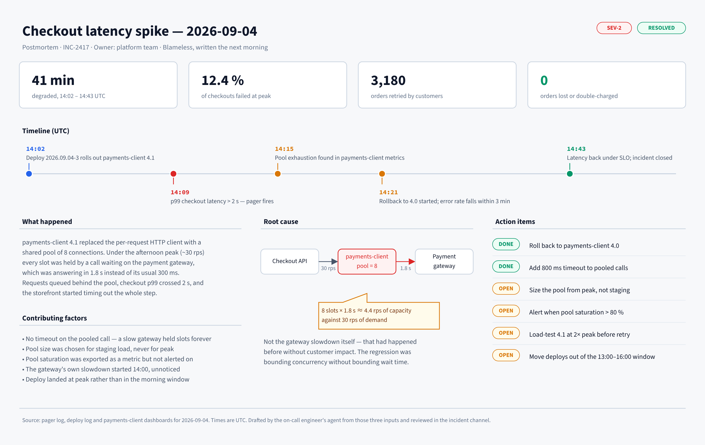

> 🌐 日本語版: [README.ja.md](./README.ja.md)

# Jiscribe

An SVG canvas that people and AI agents draw on together. Diagrams, mockups,
posters, whole documents.


An agent draws, you fix it by hand, and the agent picks up from there. Nothing
is regenerated from scratch and nothing you changed is lost, because what you
draw is a **plain object** in your code and **plain JSON** (`.jis`) on
disk — the canvas is one way to edit it, and an agent's tools are another.

Most of what you need to draw is already in the box. The core carries eight
primitive types (`rect` / `ellipse` / `text` / `polyline` / `polygon` / `group` /
`connector` / `svg`), and the richer shape sets — flowchart, UML, sticky,
markdown, container, annotation, general pictograms, Lucide icons, AWS
architecture — ship as plugins. More sets are on the way.

## What you can make

|                                                                                                                                                                                               |                                                                                                                                                                                                           |
| --------------------------------------------------------------------------------------------------------------------------------------------------------------------------------------------- | --------------------------------------------------------------------------------------------------------------------------------------------------------------------------------------------------------- |
| <br>**UML and class diagrams** — packages, interfaces, composition, multiplicities, notes           | <br>**Architecture diagrams** — AWS icons and boundary groups, from region down to subnet                                 |
| <br>**Infrastructure, drawn to scale** — every solid is a native polygon on a 30° lattice | <br>**UI mockups** — a trading terminal: candles, order book, tape, at the fidelity a spec needs                                |
| <br>**Posters and print** — a typographic grid is just shapes and text                                     | <br>**Flows and swimlanes** — handoffs, decisions, exceptions, and the icon that says what each step touches |



**Whole documents on one canvas** — a postmortem: numbers, timeline, cause, action items

Every image in this gallery is a `.jis.png`: the exported picture carries the
document that drew it, so it is an image wherever an image is needed and still
a document when you open it in Jiscribe. None of it is a special mode. Each one
is an ordinary document of shapes, text and connectors — the kind an agent can
write and a person can move by hand.

## Built for agents, not bolted onto them

- **It edits one move at a time; it does not regenerate.** 69 tools over
  stdio, the same moves you make in the editor: add and connect, align and
  distribute, group, restyle, reorder, select. An edit lands on the document
  you have, so what you placed by hand stays where you put it, and `undo` takes
  back only the agent's own moves.
- **When starting from nothing, it writes the file.** The format is small and
  explicit — eight primitives, named properties, coordinates in the open — so
  an agent can write a `.jis` directly, or generate one from a script
  when a 200-node graph or an isometric lattice is easier to compute than to
  place. Both ways are documented: the drawing guide for the tools, the
  format reference for the file.
- **It checks before it says it is done.** `validate`, `diagnose` and
  `measure` run headless in Node, in the same layout engine the editor uses —
  schema errors, parser errors, text that overflows its shape — and it can
  capture the canvas and look. The agent is told what the editor would tell
  you.
- **You can both have it open.** A local viewer follows the file as the agent
  writes it; drag something there and it is written back, so the agent's next
  read sees your hand. Writes to one file are serialized, and the agent's
  `undo` never rolls back yours.
- **The format is written down, not guessed at.** A JSON Schema and a
  generated reference ship with the shapes, and the Claude Code skill is
  generated from the same manifest — so the shape set an agent is told about
  is the shape set that exists.

## Getting started

### With an agent

Register the MCP server in any client that speaks stdio:

```jsonc
{
	"mcpServers": {
		"jiscribe": { "command": "npx", "args": ["-y", "jiscribe-mcp"] },
	},
}
```

Node 22 or newer is required; nothing else is. The
[`jiscribe-mcp`](https://www.npmjs.com/package/jiscribe-mcp) package carries
the server, the viewer and the fonts its text measurement needs. See
[`apps/mcp`](./apps/mcp) for the tool list and the viewer's behaviour.

In Claude Code, the plugin does that for you and adds a drawing skill generated
from the shape set:

```text
/plugin marketplace add gznnk/jiscribe
/plugin install jiscribe
```

### In an editor

[Jiscribe for VSCode](https://marketplace.visualstudio.com/items?itemName=gznnk.jiscribe)
opens `.jis`, `.jis.png` and `.jis.svg` as editable canvases next to your
code, with diagnostics in the Problems panel. Pair it with the MCP server and
the agent draws with its own checks — diagnose, measure, capture — while you
watch the file take shape in VSCode.

If you just want to draw something by hand without installing anything,
[Jiscribe Web](https://app.jiscribe.dev/) opens a canvas in the browser — no
account, no upload, files stay on your machine.

## Embedding the engine (not on npm yet)

The packages themselves are not on npm yet. `@jiscribe/canvas` and the rest
are still being settled as an embedding surface, so the public API may move.
The first release will go out as a GitHub Release — watch this repository under
Custom → Releases to hear about it. What the API looks like today:

```tsx
import { Canvas } from "@jiscribe/canvas";
import type { CanvasDoc } from "@jiscribe/canvas";

const doc: CanvasDoc = { version: 1, root: [] };

export function App() {
	return <Canvas doc={doc} />;
}
```

Shapes beyond the primitives come from plugins, registered per canvas:

```tsx
import { Canvas } from "@jiscribe/canvas";
import type { CanvasConfig } from "@jiscribe/canvas";
import { flowchartPlugin } from "@jiscribe/plugin-flowchart-shapes";
import { umlPlugin } from "@jiscribe/plugin-uml-shapes";

const config: CanvasConfig = { plugins: [flowchartPlugin, umlPlugin] };

export function App() {
	return <Canvas doc={doc} initialConfig={config} />;
}
```

The **document layer is a package of its own**, `@jiscribe/doc`. It parses,
validates, edits and measures a `CanvasDoc` without pulling in React or any DOM
dependency — that is what the VSCode extension's diagnostics, the CLI and the AI
tooling are all built on. If your product needs the document but not the canvas,
that is the package to take.

## How it fits together

| Package                      | What it is                                                                                                |
| ---------------------------- | --------------------------------------------------------------------------------------------------------- |
| `@jiscribe/canvas`           | The engine: rendering, gestures, commands, state                                                          |
| `@jiscribe/doc`              | The headless document layer: the `CanvasDoc` model, its parser, its editing ops and its `.jis.*` file I/O |
| `@jiscribe/canvas-sdk`       | Shape-authoring kit for plugin authors, written against the canvas public API                             |
| `@jiscribe/geometry`         | Geometry types and calculations (rects, ellipses, transforms, intersections)                              |
| `@jiscribe/markdown`         | Markdown rendering used by the markdown shape                                                             |
| `@jiscribe/basic-validators` | Primitive runtime validators                                                                              |
| `@jiscribe/utility-types`    | Shared TypeScript utility types                                                                           |
| `@jiscribe/doc-schema`       | Generated JSON Schema, AI reference and Claude Code skill for the shipped shape set                       |
| `@jiscribe/ai-tools`         | The canvas tool set an AI can call — declared free of any transport, and applied                          |
| `@jiscribe/standard-shapes`  | The shipped shape set, bundled once for every host (doc + presentation entries)                           |
| `@jiscribe/doc-tools`        | Validate / measure / diagnose over the standard set (Node text measurer included)                         |
| `plugins/*`                  | The shipped shape sets — flowchart, UML, container, general, annotation, sticky, markdown, Lucide, AWS    |
| `apps/canvas-examples`       | Integration examples (one example = one file)                                                             |
| `apps/cli`                   | The `jiscribe` command: validate / diagnose / measure / render / preview                                  |
| `apps/mcp`                   | MCP server: the tool set over stdio, with a local canvas viewer                                           |
| `apps/claude-plugin`         | The Claude Code plugin: the MCP server and a generated drawing skill                                      |
| `apps/vscode-extension`      | The Jiscribe VSCode extension                                                                             |

The `plugins/` directory is deliberately treated as _external_: those packages
may only use the public API of `@jiscribe/canvas`, `@jiscribe/doc` and
`@jiscribe/canvas-sdk`, enforced by ESLint. If the shipped shapes can be written
that way, so can yours.

## Development

```bash
pnpm install

pnpm dev:examples      # run the examples gallery
pnpm build:examples    # build the examples gallery
pnpm build:vscode      # build the VSCode extension
pnpm build:mcp         # build the MCP server and its viewer
pnpm build:cli         # build the jiscribe command

pnpm lint              # ESLint across the workspace
pnpm typecheck         # TypeScript across the workspace
pnpm dep:check         # circular dependency check (madge)
pnpm format            # Prettier
pnpm test              # unit tests (vitest)
pnpm test:e2e          # every Playwright suite (core, each plugin, coexistence)
```

Requirements: Node.js 22+ and pnpm 11.

Design documentation for the engine lives in
[`packages/canvas/docs/`](./packages/canvas/docs/README.md) — 13 documents
covering the design philosophy, architecture, data model, gesture system,
command system, state update flow, external sync, theming, testing, style
properties, shape design, plugin architecture and plugin authoring. Japanese
versions are alongside as `*.ja.md`.

## Contributing

**Issues are welcome; pull requests are accepted by prior agreement only** — open
an issue first and wait for a reply saying the change is wanted. See
[CONTRIBUTING.md](./CONTRIBUTING.md#how-contributions-work) for why, and for
everything else you need to get a change merged.

Note that most in-code comments and some design documents are written in
Japanese; English is fine for issues and pull requests.

## Third-party assets

The AWS shape set (`plugins/aws-shapes`) ships the drawings of the **AWS
Architecture Icons**, © Amazon Web Services, Inc. or its affiliates. **The MIT
license below does not cover them**: they are used under AWS's own terms,
redistributed unmodified with attribution, and must not be modified. See
[`plugins/aws-shapes/LICENSE-ICONS.md`](./plugins/aws-shapes/LICENSE-ICONS.md).

## License

[MIT](./LICENSE) © gznnk
