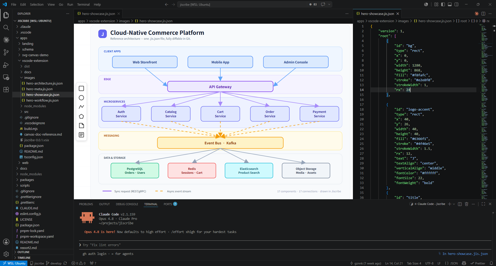
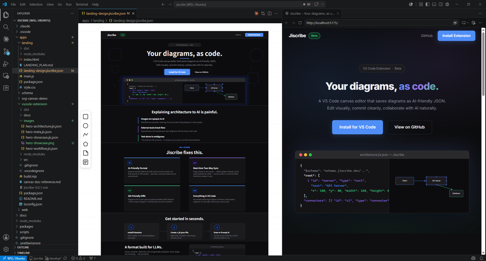

# Jiscribe (Beta)



**A VS Code-native canvas editor for visual communication between AI and humans.**

🌐 **[beta.jiscribe.dev](https://beta.jiscribe.dev)**

Do you find it limiting to explain architectures and UI layouts to AI using only text?  
Jiscribe is an extension that saves intuitively drawn diagrams as simple, AI-friendly JSON (`.jis.json`), and lets you view and edit them via an integrated SVG canvas editor.

Complete your visual documentation locally in VS Code—no need to switch to external web tools. Treat your diagrams just like code with full Git version control!

---

## 💡 Why Jiscribe?

### 🤖 1. AI-Friendly Data Structure

Instead of image formats (PNG) or complex XML (SVG), Jiscribe uses a semantically organized, schema-backed JSON format. This makes it trivial for Large Language Models (LLMs) to read shapes to generate code, or to output a diagram (JSON) based on a text prompt.

_(Our public JSON schema that powers this is available at: `https://schema.jiscribe.dev/v1/jiscribe.schema.json`)_

### 🤝 2. Visual Communication with AI

Experience a completely new workflow with real-time text-and-canvas synchronization:

- Tweak the layout of a diagram generated by an AI directly on the canvas.
- Sketch a rough layout on the canvas and have the AI write the specifications based on it.

### 🐙 3. Perfect Git Version Control

Because the files are neatly formatted JSON, you can easily review diffs in Git. You'll instantly see "which shape's width changed" or "what text was modified." Reviewing architectural PRs is now as easy as reviewing code.

### ⚡ 4. Everything in VS Code



Say goodbye to context-switching between external drawing apps and your editor. Draw system diagrams and flowcharts in a tab right next to your source code.

---

## 🛠 Key Features

- **Two-way Sync Between Visual and Text Editors**
  - Visual modifications on the canvas instantly update the underlying JSON.
  - Editing the JSON directly in the text editor (e.g., auto-completion by Copilot) renders to the canvas immediately.
- **Intuitive Canvas Operations**
  - Place primitives like Rectangles, Ellipses, Polylines, and Polygons.
  - Connect shapes natively using Connectors.
  - Group existing objects easily.
- **Top-tier Developer Experience**
  - Powerful auto-completion via the integrated JSON schema.
  - Find syntax errors and broken connections at a glance (integrated with the Problems panel).

---

## Usage

1. Create a file with the `.jis.json` extension in your workspace.
2. VS Code will automatically open it using the Jiscribe Canvas Editor.
3. Edit the shapes on the canvas; the underlying JSON updates automatically.

> If you want to open it as text, right-click the tab and select "Open With... -> Text Editor".

---

## File Format & Schema

`.jis.json` (short for `.jiscribe.json`) is essentially a JSON representation of an SVG canvas.  
The JSON Schema is published at:  
`https://schema.jiscribe.dev/v1/jiscribe.schema.json`

### Top-level Structure

```json
{
	"$schema": "https://schema.jiscribe.dev/v1/jiscribe.schema.json",
	"version": 1,
	"root": [],
	"connectors": []
}
```

- **`version`**: The schema version of the file format (currently `1`).
- **`root`**: Contains all the canvas object documents (can be nested within groups).
- **`connectors`**: Defines the connection lines between shapes.

_(More detailed references will be available on our doc site soon!)_

---

## License

Copyright © 2026 gznnk. All rights reserved.

Jiscribe is proprietary software; its source code is not publicly available.
Use of this extension is governed by [LICENSE.txt](./LICENSE.txt).
