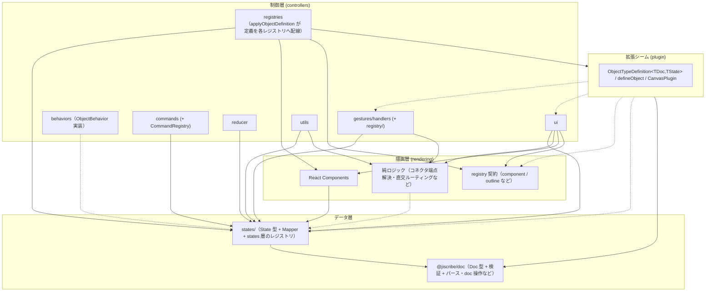

> 🌐 English version: [02-architecture.md](./02-architecture.md)

# アーキテクチャ

`canvas` の内部構造とレイヤー分離。設計判断の背景は
[設計思想](./01-design-philosophy.ja.md) を参照。

## 設計原則

1. **レイヤー分離**: 下から順にデータ層（`@jiscribe/doc` の Doc モデルと `states/`）・描画層（rendering）・制御層（controllers）を明確に分離する。**制御層が最上位**で、描画層のコンポーネントを組み立てて画面を作る
2. **一方向依存**: 上位レイヤーは下位レイヤーに依存し、逆方向の依存は禁止する
3. **Registry パターン**: 形状ごとの機能を動的に解決し、拡張性を確保する
4. **State + Mapper の共配置**: 形状ごとにフォルダを作り、State と Mapper をセットで配置する

## ディレクトリ構成

主なディレクトリだけを示す（網羅ではない）。

```
packages/canvas/src/
├── index.ts                # パッケージエントリ（公開 API。Canvas / CanvasDoc / パース結果型など）
├── states/                 # ランタイム状態型（State モデル）+ Mapper
│   ├── canvas/             # CanvasState / CanvasMapper
│   ├── objects/            # 図形ごとの State + Mapper
│   └── registry/           # states 層のレジストリ（ObjectMapperRegistry など）
├── controllers/            # 状態管理 + ビジネスロジック
│   ├── Canvas.tsx
│   ├── gestures/           # ジェスチャー認識 + ハンドラ + そのレジストリ（GestureHandlerRegistry / ObjectBehaviorRegistry）
│   ├── behaviors/          # ObjectBehavior 実装（型ごとの移動・変形・回転）
│   ├── commands/           # Command パターン（操作の種類ごとのサブフォルダ）+ CommandRegistry
│   ├── reducer/            # canvasReducer + CanvasActions
│   ├── hooks/              # useCanvasReducer / useSyncExternalDoc など
│   ├── registries/         # レジストリのバンドルの生成と配線（createCanvasRegistries など）
│   ├── ui/                 # 変形コントロール・メニュー・アイコンなど UI 制御（StencilRegistry / ObjectMenuRegistry などを含む）
│   └── utils/
├── rendering/              # 純粋な描画コンポーネント + Viewport 型
│   └── objects/registry/   # 描画層のレジストリ（ObjectComponentRegistry など）
├── plugin/                 # 拡張シーム（ObjectTypeDefinition / defineObject / CanvasPlugin）
└── theme/                  # CanvasTheme・プリセット・CSS 変数 + スタイルが読む `theme` トークン
```

Doc モデルはこのパッケージには**無い**。canvas が依存する `@jiscribe/doc`
（`packages/doc/src/`）にあり、主に `model/`（Doc 型 + 型別の検証）・`plugin/`
（`ObjectDocDefinition` / `CanvasDocPlugin` / `resolveDocDefinitions` /
`ObjectDocValidatorRegistry` / `ObjectFactoryRegistry` など）・`parse/`
（`createCanvasParser` / `validateStructure` / `validateSemantics` など）・`ops/`
（`createDocOps`）・`text/`（テキスト計測）・`file/`（`.jis.png` / `.jis.svg` への
ソース埋め込み）からなる。いずれも `@jiscribe/doc` から取る →
[`packages/doc/README.md`](../../doc/README.md)。

形状ごとに、`states/objects/.../<shape>/` と `controllers/behaviors/...`、
`rendering/objects/...` が対応する。コアの型の一覧は `@jiscribe/doc` の
`model/objects/types/ObjectType.ts`（`ObjectTypes`）が正本で、それ以外の図形はプラグインが足す
→ [プラグインアーキテクチャ](./12-plugin-architecture.ja.md)。

## レイヤー構成と依存関係

### データ層（`@jiscribe/doc` + states）

- **`@jiscribe/doc`**: 永続化データ（ファイル）の型定義（Doc モデル）。独立したパッケージ（`packages/doc/src/model/`）にある。木構造を持つ（`GroupDoc` は `children` 配列を持つ）。
- **states/**: ランタイムの状態型（State モデル）+ Mapper。フラット構造（`objects` は ID をキーとした `Record`）に正規化し、編集操作のパフォーマンスを上げる。

依存: `states → @jiscribe/doc`（State は Doc から変換される）。

### 描画層（rendering）

State を Props として受け取り SVG を描画するコンポーネント。ドキュメントやキャンバスの状態は持たず、
書き換えもしない（描画に閉じた局所状態は持ってよい）。イベントハンドラも受け取らない。操作の対象は
`data-*` 属性（`data-kind` / `data-id` / `data-part` など）で宣言し、それを受けて振り分けるのはルートの
ジェスチャシステム → [描画・テーマ](./08-rendering-and-theme.ja.md)。
上位の制御層から組み立てられる側で、自分より上を知らない。

依存: `rendering → states / @jiscribe/doc / theme`（states の型と純粋関数、`EndpointRef` などの doc 型や `AUTO_COLOR` などの定数、テーマトークン）。`controllers` には依存しない。

### 制御層（controllers）

- **gestures/handlers/**: ジェスチャーを受けて `CanvasState` を更新する。対象ごとの EventHandler をサブフォルダ（`objects/` / `controls/` など）に置き、`handleGesture.ts` が振り分ける。
- **behaviors/**: `ObjectBehaviorRegistry` に登録される `ObjectBehavior` 実装（契約は `gestures/registry/ObjectBehaviorTypes.ts` の `ObjectBehaviorEntry`）。型ごとの Controller は `primitives/` と `connector/` に置く。枠（Frame）で表せる型（例: rect / ellipse）は Controller を持たず、`base/FrameController.ts` の `createFrameBehavior` で作る。変形の共通ロジックも `base/` にある。`gestures` / `commands` / `reducer` / `utils` からレジストリ経由で使われる。
- **commands/**: ショートカット・メニュー・ツールバー共通の操作 → [コマンドシステム](./05-command-system.ja.md)。
- **reducer/**: アクションを各ハンドラへ振り分ける → [状態更新フロー](./06-state-update-flow.ja.md)。
- **ui/**: 変形コントロールやメニューなど UI 制御ロジック。

依存: `controllers → rendering → states / @jiscribe/doc`。制御層は描画層の**上**に乗るので、UI コントローラが描画層のコンポーネント（例: `PendingConnectorOverlay` → `ConnectorRenderer`、`ArrowHeadIconPreview` → `Arrow`）や registry Context（`RenderingRegistriesProvider` など）を import するのは、上位が下位の部品を組み立てる通常の合成であって例外ではない。

構造上の課題として残るのは、描画と無関係な純幾何ロジックが描画層に置かれていること。コネクタ端点解決・直交ルーティング（`rendering/layers/content/utils/endpoints` / `routing`）は `ui` だけでなく `gestures`（Free 端点のスナップ・再アンカー）と `utils`（削除時の端点 Free 化・バウンディングボックス・可視判定）からも参照される。削除時に永続化される Free 端点座標もこの解決を通す（削除時点の見た目の位置を捕捉する意図）。依存の向きは保たれているが、本来は controllers / rendering の下に置きたい層。

### レジストリ群（分散型 — 単一の「registry 層」は存在しない）

**トップレベルの `src/registry/` ディレクトリも `ObjectRegistry` クラスも存在しない**。形状ごとの機能は、**それぞれが属するレイヤーに共配置された**複数の小さなレジストリで解決される。

主なレジストリは次のとおり。全体の正本は各 `<Canvas>` が持つバンドル（`controllers/registries/CanvasRegistries.ts` の `CanvasRegistries`。生成は `createCanvasRegistries.ts`）で、doc バリデータのレジストリだけはバンドルの外にある（後述）。

| 主なレジストリクラス                                                                                 | 場所                                   | 解決する対象（例）                                                                                      |
| ---------------------------------------------------------------------------------------------------- | -------------------------------------- | ------------------------------------------------------------------------------------------------------- |
| `ObjectFactoryRegistry` / `ObjectDocValidatorRegistry` など                                          | `@jiscribe/doc` の `plugin/`           | 型別 ObjectFactory（Doc / bounds 生成）、Doc バリデータ                                                 |
| `ObjectMapperRegistry` / `ObjectStateValidatorRegistry` など                                         | `states/registry/`                     | Doc ↔ State Mapper（+ features）・State バリデータ                                                      |
| `GestureHandlerRegistry` / `ObjectBehaviorRegistry`                                                  | `controllers/gestures/registry/`       | ジェスチャーハンドラ・型別の `ObjectBehavior`                                                           |
| `ObjectComponentRegistry` / `ObjectTextRegionRegistry` / `ObjectOutlineRegistry` など                | `rendering/objects/registry/`          | 描画コンポーネント・編集テキスト領域・ヒットテスト / スナップ輪郭                                       |
| `StencilRegistry` / `ObjectMenuRegistry` / `PropertyPanelRegistry` / `SelectionControlRegistry` など | `controllers/ui/...`（各ドメイン配下） | StencilLibrary プリセット・型別 ObjectMenu・型別プロパティサイドバーのセクション・型別 SelectionControl |
| `StylePropertyRegistry`                                                                              | `controllers/styleProperties/`         | スタイルプロパティ（[スタイルプロパティシステム](./10-style-properties.ja.md)）                         |
| `CommandRegistry`                                                                                    | `controllers/commands/`                | コマンド（[コマンドシステム](./05-command-system.ja.md)）                                               |

型別のレジストリは形状タイプ（`"rect"`, `"ellipse"` など）をキーにするため、形状横断的な処理を `if (type === ...)` の分岐なしで型安全に書ける。

`StencilRegistry` が答えるのは「どのプリセットが存在するか」だけで、並びはホストが宣言する。`toolbar.sections` は図形ツールだけでなく**バー全体**を表示順に並べたもので、ピン留めプリセット・カテゴリフライアウト・コマンドボタン・ズーム表示・サイドバーのトグル・区切り線・ホストが仕上げた UI（`{ type: "slot", id, node }`）を、左端寄せか右端寄せかを持つセクションに束ねる。自前のものを渡すホストは既定から残したい分を自分で並べ直すことになるので、既定はセクションごとに個別に export してある（`DEFAULT_TOOLBAR_TOOLS_SECTION` などの `DEFAULT_TOOLBAR_*_SECTION`。それらを表示順に揃えたものが `DEFAULT_TOOLBAR_SECTIONS`。正本は `controllers/ui/menu/Toolbar/toolbarSections.ts`）。並びには 3 つの規則があり、ホストも守ることを想定している。サイドバーのトグルはそのパネルが開く側の端に置く。左寄せは文書を変える操作（図形の配置・undo / redo）、右寄せは変えない操作（ズーム・ヘルプ・ホスト自身の表示系 UI）。バーにピン留めするのは基本のプリセットだけで、あくまでショートカットである。そのキャンバスに無いプリセット・カテゴリ・コマンドを名指しした項目は黙って落ち、それで宙に浮いた区切り線も一緒に落ちる。`stencilLibrary.sections` は**図形ライブラリのサイドバー**のセクションを決める。サイドバーはバーの左端のトグルでビューポートの左に開くパネルで、登録済みの全ステンシルをセクション分け・検索付きで並べる。どちらも同じ `StencilCategory` を取り、`presetIds` をレジストリに解決して、解決できない id と空になったセクションを落とす。パネルの開閉と折りたたみ状態は reducer state（`stencilLibraryPanel` (`isOpen` / `collapsedSectionIds`)）で、ツールバーからは `toggleStencilLibrary` コマンド、パネル自身のセクションヘッダと閉じるボタンからは `StencilLibraryPanelHandler` が動かす。常設パネルなのでどちらも `resetUiState` の対象外で、doc を差し替えてもユーザーが開いたままにした姿を保つ。パネルは開いている間だけマウントされ、ビューポートから自分の幅ぶんの場所を取る（オーバーレイでもスライドでもない）。その場所を取るぶんビューポートの左端が動き、放っておくと絵が画面上を一緒に流れてしまうので、`useContainerResize` が移動量を `CONTAINER_RESIZE` の `leftEdgeShift` として渡し、reducer がそのときのズームで `minX` から差し引く。絵は画面に留まったままで、パネルは左の帯を覆ったり戻したりするだけになる。この補正はカメラそのものに乗るので、`onViewportChange`（および `ref.viewport`）が返すカメラはパネルを開いている間その補正を含む。そのカメラを保存したホストが、次回マウント時にパネルを閉じた状態で復元すると、絵はパネル幅 ÷ ズームぶん横にずれて見える。

**プロパティサイドバー**は、これと同じ仕組みを反対側の端に置いたもの。ホストが宣言するのはツールバーのトグルの置き場所だけで（既定では `DEFAULT_TOOLBAR_PROPERTIES_SECTION` の `propertyPanelToggle` 項目。`toolbar.sections` を差し替えるホストは、残したければ自分で並べる）、パネルは閉じた状態から始まる。開閉とセクションの折りたたみ状態は reducer state（`propertyPanel` (`isOpen` / `collapsedSectionIds`)）で、ツールバーのトグルからも、ObjectMenu 末尾の 3 点リーダーからも（`ObjectMenuHandler` 経由）、パネル自身の閉じるボタンからも（`PropertyPanelHandler` 経由）`togglePropertyPanel` コマンドが動かす。図形ライブラリと同じく `resetUiState` の対象外で、開いている間だけマウントされ、ビューポートから自分の幅ぶんの場所を取る。開いている間はフローティングの ObjectMenu を描かない。サイドバーが ObjectMenu の内容を全て持つので、出しても重複するうえ選択のそばの絵を隠すだけになる（ObjectMenu のジェスチャハンドラは残る。サイドバーの部品がそこを通って書くため）。ただし右端にあるためビューポートの動く端は**右**だけで、補正すべきものが無い。`useContainerResize` は `leftEdgeShift` を 0 のまま新しいサイズだけを渡し、カメラには触らない。それでも描画前の再計測は要るので、フックの `layoutKey` は両パネルの開閉フラグをまとめて持つ。中身が型ごとに決まるのは ObjectMenu と同じで、`PropertyPanelRegistry` が型別のセクションを持ち（`propertyPanel` の宣言か、`createDefaultPropertyPanel` による `features` からの導出）、選択に出るのは選択中の全型が共通して持つものだけになる（`useMenuSections` と共有の `mergeSectionsByKey`。行単位まで突き合わせる）。コネクターだけは、コア型のなかで唯一セクションを導出せず手で宣言する。「線」セクションの末尾に経路の行（直角 / 直線。ObjectMenu の RoutingMenu のサイドバー版）と、経路をエンジンに返すボタン（`resetConnectorRoute`。手で置いた頂点が無い間は隠さず disabled）が付き、ラベル用のセクションが 2 つ加わる。「ラベル」が文字と面、「ラベルの枠線」が枠線で、図形の「テキスト」と「枠線」が別れているのと同じ分け方（1 つにまとめると「幅」「色」の行がどちらのものか読めない）。どちらも `isShown` を持ち、ラベルに文字があるときだけ出る（全ての行が何も描かない状態で見出しだけが残るのを防ぐため）。何も選択していない間は、型別のセクションの代わりに文書自身の設定（`background`）を編集する「キャンバス」セクションを出し、その書き込みは `DOCUMENT_PROPERTY_UPDATE` で reducer に届く。選択があるときは、型に属さないセクションを型別セクションの後ろにパネル自身が足す。コネクターやプラグインの型も宣言なしでこれを得る。「重ね順」は重なり順のコマンドをテキストボタンで並べたもので、`isArrangeableSelection`（ObjectMenu の重なり順フライアウトを出す判定と同じ）が真のとき出る。「メタ情報」は選択が 1 個のオブジェクト（またはコネクター）を指すとき（`isMetaSectionShown`）だけ出て、そのオブジェクトの `meta.name` / `meta.description` を編集する。書き込みは `META_PROPERTY_UPDATE` で、STYLE / TRANSFORM / DOCUMENT と並ぶプロパティ経路の 1 つ。描画に関わらない値なので再計測は要らず、グループを選んでいればグループ自身の meta を書き、子には及ばない。

### canvas 単位のレジストリ（`CanvasConfig`）

これらのレジストリは**モジュールシングルトンではない**。各 `<Canvas>` インスタンスが自前の**バンドル**（`CanvasRegistries`＝各レジストリクラスのインスタンス一式）を持ち、`controllers/registries/createCanvasRegistries(config?)` が生成する。これにより、同一ページ上の2つの canvas を異なる object type / command セットで動かせる（プラグイン的拡張・機能制限）。`config` 未指定時は共有のフルデフォルト（`defaultCanvasRegistries`）を再利用する。

```ts
<Canvas initialConfig={{ objectTypes: ["rect", "ellipse"], commands: ["undo", "redo"] }} />
```

`initialConfig` は **mount 時に一度だけ**読まれる。capability セットは canvas の identity の一部なので、以降の `initialConfig` 変更は無視される。実行時に再構成したい場合は React の `key` を変えて remount する。

バンドルは2経路で消費者に届く（#165・Option B）:

- **React ツリー**（コンポーネント／フック）→ `CanvasRegistriesContext` ＋ `useCanvasRegistries()`。描画層は制御層のバンドル型を import できないため、描画層が読むレジストリは rendering 層の Context（`ObjectComponentRegistryContext` など。まとめて供給するのが `RenderingRegistriesProvider`）で配る。
- **純粋な reducer/handler/util ツリー**（React context を読めない）→ バンドルは `CanvasControllerState` には**載せない**（データではなく依存だから）。`createCanvasReducer(registries)` がクロージャで捕捉し、各 handler/command に明示的な `registries` 引数として渡す（`handleGesture(state, gesture, registries)`、`command.execute(state, registries)` など）。`state` を持たない leaf util は該当 sub-registry を引数で受ける。

`createCanvasRegistries` は空のレジストリ群を作り、`initialize*`（`initializeGestureHandlerRegistry` / `initializeCommands` など）と型ごとの `applyObjectDefinition` で**そのバンドル**を埋める（object type は既定で全部、または `config` の部分集合。`config.plugins` の型も同じ `applyObjectDefinition` で足す。順序は `createCanvasRegistries` の JSDoc 参照）。唯一の例外は doc バリデータのレジストリで、これは `@jiscribe/doc` に閉じ、`createCanvasParser` が渡された定義集合からパーサーごとに構築する：入力境界のパース時検証でのみ使われ（`<Canvas>` 生成前）、ヘッドレスパッケージが UI 依存を引き込まないようにするため → [データモデル](./03-data-model-and-persistence.ja.md)。

> **意味論の注意**: `config.objectTypes` で型を絞った場合、呼び出し側は有効な型だけを含む doc を渡す責任を負う。無効な型を含む doc は `canvasToState` が `"Mapper not found"` を throw する（「呼び出し側が valid/consistent な doc を渡す」契約と一致 → [設計思想](./01-design-philosophy.ja.md) 原則4）。既定 config（全型）は後方互換。

> **`CanvasMapper` について**: `CanvasDoc ↔ CanvasState` の全体変換は形状ごとの Mapper を多態的に呼ぶ必要があるため、`states/canvas/CanvasMapper.ts` はグローバル参照ではなく、要るレジストリを 1 つずつ引数で受け取る（`ObjectMapperRegistry` など。シグネチャは `CanvasMapper.ts` 参照）。呼び出し側が canvas 自身のバンドル（純粋ツリーに通されるもの、例: `createInitialControllerState`）から該当するもの（`registries.objectMapper` など）を渡す。受け取るのはどれも `states/registry/` にある states 層自身のレジストリなので、レイヤーをまたぐ例外ではない。

## 依存関係グラフ

Jiscribe 版（レイヤーを枠で表現した見やすい図）は [02-architecture.jis.json](./02-architecture.jis.json) を参照。
どちらも主なフォルダと主な依存だけを描く（網羅ではない）。実線は値の参照、破線は型のみの参照。



`@jiscribe/doc` の型・定数（`EndpointRef` / `AUTO_COLOR` など）と `theme/`（`theme` トークン）への直接参照はほぼ全域から存在するため、図では省略している。

**`plugin`（拡張シーム）について**: `plugin/` には形状/プラグイン作者が書く宣言的語彙 — `ObjectTypeDefinition<TDoc, TState>`、`defineObject`、`CanvasPlugin` — を置く。1つの定義が**全レイヤーの型契約を集約する**（states の mapper/state、`@jiscribe/doc` の doc/features/factory、`gestures/registry` の `ObjectBehaviorEntry`、`ui` の menu/controls/`Stencil`、rendering の component/textRegion/outline 契約など）ため、`plugin` はこのパッケージの3レイヤーと doc パッケージのすべてに依存する。逆に `controllers/registries` は、組み込み定義の構築（`defineObject`）と適用（`applyObjectDefinition` → 各レジストリ）のために `plugin` に依存する。`ui` のプロパティパネル導出（`derivePropertyPanel`）も `plugin` の判定関数を値で使う。サブグラフ単位で見ると **`controllers ⇄ plugin` の相互参照**であり、上図の矢印は Controllers の境界を双方向に横切っている。

これは意図的に、具象的な import 循環には**なっていない**: `plugin` から canvas の他レイヤーへの import はすべて型のみで、その先のモジュールが `plugin` を import し返すことはない。`plugin` を値で使うのは `registries/applyObjectDefinition` や `ui` の `derivePropertyPanel` など別のファイルで、`plugin` が型を取りに行くモジュールからは import されない。そのため madge `dep:check` はフォルダ同士が相互参照していても green のまま。`applyObjectDefinition`（実行時の配線）を `plugin` ではなく `registries` に置いていることがこれを保っている。

依存の向きは lint でも検査している。ESLint（`eslint.config.js`）が `rendering` から `controllers` への値 import と、controllers 内で下の層から上の層への値 import（層の順は `CONTROLLER_LAYERS`）を弾き、madge `dep:check` が循環を弾く → [テスト](./09-testing.ja.md)。

## 新しい形状の追加手順

コアに型を足す手順。Registry パターンにより、次の手順で完結する（プラグインとして図形を足すなら [プラグインの作り方](./13-authoring-plugins.ja.md)）。

1. **Doc**: `@jiscribe/doc` の `model/objects/primitives/<shape>/<Shape>Doc.ts`（+ `validate<Shape>Doc.ts` / `<Shape>ObjectFactory.ts`）。コア型の一覧（`model/objects/types/ObjectType.ts` の `ObjectTypes`）にも足す
2. **State**: `states/objects/primitives/<shape>/<Shape>State.ts`
3. **Mapper**: `states/objects/primitives/<shape>/<Shape>Mapper.ts`（Doc ↔ State）
4. **Behavior**: `controllers/behaviors/primitives/<Shape>Controller.ts`（`ObjectBehaviorEntry` を満たす）。枠（Frame）で表せる型なら書かずに `behaviors/base/FrameController.ts` の `createFrameBehavior` を使う
5. **Component**: `rendering/objects/primitives/<Shape>/<Shape>.tsx`
6. **登録**: 定義は headless 側と UI 側の 2 段で、UI 側が headless 側を取り込む。
   - `@jiscribe/doc` の `plugin/builtinObjectDocDefinitions.ts` — headless 側の定義（Doc バリデータ・features・factory など）。`createCanvasParser` / `createDocOps` が既定で使う定義集合はここから作られる
   - `controllers/registries/applyObjectDefinition.ts` の `BUILTIN_OBJECT_DEFINITIONS` — 上の定義を spread し（`...builtinObjectDocDefinitions.<shape>`）、Mapper / Component / behavior / State バリデータなど UI 側を足す。spread せずに UI 側だけに書くと、UI では動くのにパーサーが未知の型として除去する
7. **AI 向けスキーマ**: [`packages/doc-schema/README.md`](../../doc-schema/README.md) の「図形を追加するとき」に従って、スキーマと AI 向けドキュメントを再生成する

既存ロジックの分岐を増やさず、登録だけで形状横断処理（変形・スナップ・描画）に乗る。

## 設計上の禁止事項

- ❌ `states → controllers`（状態定義がロジックに依存してはいけない）
- ❌ `@jiscribe/doc → states`（永続化型がランタイム型に依存してはいけない。パッケージ依存は canvas → doc の一方向）
- ❌ `rendering → controllers`（描画層は制御層の下。上位の制御ロジックに依存してはいけない）
- ❌ Mapper での再帰処理（Mapper は自身のプロパティのみ変換。子要素の変換は `CanvasMapper` が一元管理）
- ❌ EventHandler での形状判定（`if (type === "rect")` を避け、Registry 経由で解決）
