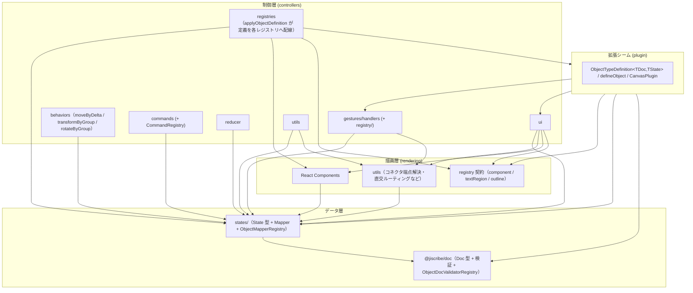

> 🌐 English version: [02-architecture.md](./02-architecture.md)

# アーキテクチャ

`canvas` の内部構造とレイヤー分離。設計判断の背景は
[設計思想](./01-design-philosophy.ja.md) を参照。

## 設計原則

1. **レイヤー分離**: 下から順にデータ層（`@jiscribe/doc` の Doc モデルと `states/`）・描画層（rendering）・制御層（controllers）を明確に分離する。**制御層が最上位**で、描画層のコンポーネントを組み立てて画面を作る
2. **一方向依存**: 上位レイヤーは下位レイヤーに依存し、逆方向の依存は禁止する
3. **Registry パターン**: 形状ごとの機能を動的に解決し、拡張性を確保する
4. **State + Mapper の共配置**: 形状ごとにフォルダを作り、State と Mapper をセットで配置する

## ディレクトリ構成

```
packages/canvas/src/
├── index.ts                # パッケージエントリ（Canvas / CanvasDoc / パース結果型を re-export）
├── doc.ts                  # @jiscribe/doc への re-export shim（利用側が呼び続けるヘッドレスエントリ）
├── unstable-doc.ts         # @jiscribe/doc/unstable への re-export shim
├── png-source.ts           # @jiscribe/doc/png-source への re-export shim
├── svg-source.ts           # @jiscribe/doc/svg-source への re-export shim
├── states/                 # ランタイム状態型（State モデル）+ Mapper
│   ├── canvas/             # CanvasState / CanvasMapper / Viewport
│   ├── objects/            # base / primitives / connector / annotations（State + Mapper）
│   └── registry/           # ObjectMapperRegistry / ObjectStateValidatorRegistry
├── controllers/            # 状態管理 + ビジネスロジック
│   ├── Canvas.tsx
│   ├── gestures/           # recognizer（認識）+ handlers + registry/（GestureHandlerRegistry / ObjectBehaviorRegistry）
│   ├── behaviors/          # ObjectBehavior 実装（moveByDelta / transformByGroup / rotateByGroup）
│   ├── commands/           # Command パターン（selection/arrange/arrow/connector/group/history/text/view）+ CommandRegistry
│   ├── reducer/            # canvasReducer + CanvasActions
│   ├── hooks/              # useCanvasReducer / useSyncExternalDoc など
│   ├── registries/         # initializeObjectRegistry / initializeGestureHandlerRegistry / initializeCommands
│   ├── ui/                 # 変形コントロール・メニュー・アイコンなど UI 制御（StencilRegistry / ObjectMenuRegistry を含む）
│   └── utils/
├── rendering/              # 純粋な描画コンポーネント（layers / objects / defs）
│   └── objects/registry/   # ObjectComponentRegistry / ObjectTextRegionRegistry / ObjectOutlineRegistry
├── plugin/                 # 拡張シーム（ObjectTypeDefinition / defineObject / CanvasPlugin）
└── constants/              # theme.ts / zoom.ts など
```

Doc モデルはこのパッケージには**無い**。canvas が依存する `@jiscribe/doc`
（`packages/doc/src/`）にあり、`model/`（Doc 型 + 型別の検証）・`plugin/`
（`ObjectDocDefinition` / `CanvasDocPlugin` / `resolveDocDefinitions` /
`ObjectDocValidatorRegistry` / `ObjectFactoryRegistry`）・`parse/`
（`createCanvasParser` / `validateStructure` / `validateSemantics`）・`ops/`
（`createDocOps`）・`text/`（テキスト計測）・`file/`（`.jis.png` / `.jis.svg` への
ソース埋め込み）で構成される。上記の 4 つの shim が、利用側が使ってきた
`@jiscribe/canvas/*` のパスでそれらを re-export している →
[`packages/doc/README.md`](../../doc/README.md)。

形状ごと（rect / ellipse / diamond / group / polygon / polyline / connector / sticky / svg）に、
`states/objects/.../<shape>/` と `controllers/behaviors/...`、
`rendering/objects/...` が対応する。

## レイヤー構成と依存関係

### データ層（`@jiscribe/doc` + states）

- **`@jiscribe/doc`**: 永続化データ（ファイル）の型定義（Doc モデル）。独立したパッケージ（`packages/doc/src/model/`）にある。木構造を持つ（`GroupDoc` は `children` 配列を持つ）。
- **states/**: ランタイムの状態型（State モデル）+ Mapper。フラット構造（`objects` は ID をキーとした `Record`）に正規化し、編集操作のパフォーマンスを上げる。

依存: `states → @jiscribe/doc`（State は Doc から変換される）。

### 描画層（rendering）

State を Props として受け取り SVG を描画するだけの純粋コンポーネント。
ロジック・状態を持たず、イベントハンドラは Props 経由で受け取る → [描画・テーマ](./08-rendering-and-theme.ja.md)。
上位の制御層から組み立てられる側で、自分より上を知らない。

依存: `rendering → states / @jiscribe/doc`（Props の型に加え、`EndpointRef` などの doc 型や `AUTO_COLOR` などの定数も参照する）。

### 制御層（controllers）

- **gestures/handlers/**: ジェスチャーを受けて `CanvasState` を更新する。`objects/` と `controls/` の配下に対象ごとの EventHandler を置く。
- **behaviors/**: `ObjectBehaviorRegistry` に登録される `ObjectBehavior` 実装（`moveByDelta` / `transformByGroup` / `rotateByGroup`）。形状ごとの Controller は `primitives/` と `connector/`、共通変形ロジックは `base/`（FrameTransform / PolyTransform / GroupTransform）。`gestures` / `commands` / `reducer` / `utils` からレジストリ経由で使われる。
- **commands/**: ショートカット・メニュー・ツールバー共通の操作 → [コマンドシステム](./05-command-system.ja.md)。
- **reducer/**: アクションを各ハンドラへ振り分ける → [状態更新フロー](./06-state-update-flow.ja.md)。
- **ui/**: 変形コントロールやメニューなど UI 制御ロジック。

依存: `controllers → rendering → states / @jiscribe/doc`。制御層は描画層の**上**に乗るので、UI コントローラが描画層のコンポーネント（例: `PendingConnectorOverlay` → `ConnectorRenderer`、`ArrowHeadIconPreview` → `Arrow`）や registry Context（`RenderingRegistriesProvider` など）を import するのは、上位が下位の部品を組み立てる通常の合成であって例外ではない。

構造上の課題として残るのは、描画と無関係な純幾何ロジックが描画層に置かれていること。コネクタ端点解決・直交ルーティング（`rendering/layers/content/utils/endpoints` / `routing`）は `ui` だけでなく `gestures`（Free 端点のスナップ・再アンカー）と `utils`（削除時の端点 Free 化・バウンディングボックス・可視判定）からも参照される。削除時に永続化される Free 端点座標もこの解決を通す（削除時点の見た目の位置を捕捉する意図）。依存の向きは保たれているが、本来は controllers / rendering の下に置きたい層。

### レジストリ群（分散型 — 単一の「registry 層」は存在しない）

**トップレベルの `src/registry/` ディレクトリも `ObjectRegistry` クラスも存在しない**。形状ごとの機能は、**それぞれが属するレイヤーに共配置された**複数の小さなレジストリで解決される。

| レジストリクラス                                                                 | 場所                                   | 解決する対象                                                      |
| -------------------------------------------------------------------------------- | -------------------------------------- | ----------------------------------------------------------------- |
| `ObjectFactoryRegistry` / `ObjectDocValidatorRegistry`                           | `@jiscribe/doc` の `plugin/`           | 型別 ObjectFactory（Doc / bounds 生成）、Doc バリデータ           |
| `ObjectMapperRegistry` / `ObjectStateValidatorRegistry`                          | `states/registry/`                     | Doc ↔ State Mapper（+ features）・State バリデータ                |
| `GestureHandlerRegistry` / `ObjectBehaviorRegistry`                              | `controllers/gestures/registry/`       | ジェスチャーハンドラ・`moveByDelta` / `transformByGroup`          |
| `ObjectComponentRegistry` / `ObjectTextRegionRegistry` / `ObjectOutlineRegistry` | `rendering/objects/registry/`          | 描画コンポーネント・編集テキスト領域・ヒットテスト / スナップ輪郭 |
| `StencilRegistry` / `ObjectMenuRegistry` / `SelectionControlRegistry`            | `controllers/ui/...`（各ドメイン配下） | StencilLibrary プリセット・型別 ObjectMenu・型別 SelectionControl |
| `CommandRegistry`                                                                | `controllers/commands/`                | コマンド（[コマンドシステム](./05-command-system.ja.md)）         |

各レジストリは形状タイプ（`"rect"`, `"ellipse"` など）をキーにするため、形状横断的な処理を `if (type === ...)` の分岐なしで型安全に書ける。

### canvas 単位のレジストリ（`CanvasConfig`）

これらのレジストリは**モジュールシングルトンではない**。各 `<Canvas>` インスタンスが自前の**バンドル**（`CanvasRegistries`＝各レジストリクラスのインスタンス一式）を持ち、`controllers/registries/createCanvasRegistries(config?)` が生成する。これにより、同一ページ上の2つの canvas を異なる object type / command セットで動かせる（プラグイン的拡張・機能制限）。`config` 未指定時は共有のフルデフォルト（`defaultCanvasRegistries`）を再利用する。

```ts
<Canvas initialConfig={{ objectTypes: ["rect", "ellipse"], commands: ["undo", "redo"] }} />
```

`initialConfig` は **mount 時に一度だけ**読まれる。capability セットは canvas の identity の一部なので、以降の `initialConfig` 変更は無視される。実行時に再構成したい場合は React の `key` を変えて remount する。

バンドルは2経路で消費者に届く（#165・Option B）:

- **React ツリー**（コンポーネント／フック）→ `CanvasRegistriesContext` ＋ `useCanvasRegistries()`。描画層は制御層のバンドル型を import できないため、コンポーネントレジストリだけは rendering 層の `ObjectComponentRegistryContext` で配る。
- **純粋な reducer/handler/util ツリー**（React context を読めない）→ バンドルは `CanvasControllerState` には**載せない**（データではなく依存だから）。`createCanvasReducer(registries)` がクロージャで捕捉し、各 handler/command に明示的な `registries` 引数として渡す（`handleGesture(state, gesture, registries)`、`command.execute(state, registries)` など）。`state` を持たない leaf util は該当 sub-registry を引数で受ける。

`initializeObjectRegistry(registries)` / `initializeGestureHandlerRegistry(registries)` / `initializeCommands(registries, commandIds?)` は**渡されたバンドル**を登録し、`createCanvasRegistries` がそれらを配線する（既定は全 object type、または `config` の部分集合）。唯一の例外は doc バリデータのレジストリで、これは `@jiscribe/doc` に閉じ、`createCanvasParser` が渡された定義集合からパーサーごとに構築する：入力境界のパース時検証でのみ使われ（`<Canvas>` 生成前）、ヘッドレスパッケージが UI 依存を引き込まないようにするため → [データモデル](./03-data-model-and-persistence.ja.md)。

> **意味論の注意**: `config.objectTypes` で型を絞った場合、呼び出し側は有効な型だけを含む doc を渡す責任を負う。無効な型を含む doc は `canvasToState` が `"Mapper not found"` を throw する（「呼び出し側が valid/consistent な doc を渡す」契約と一致 → [設計思想](./01-design-philosophy.ja.md) 原則4）。既定 config（全型）は後方互換。

> **`CanvasMapper` について**: `CanvasDoc ↔ CanvasState` の全体変換は形状ごとの Mapper を多態的に呼ぶ必要があるため、`states/canvas/CanvasMapper.ts` はグローバル参照ではなく `ObjectMapperRegistry` を引数で受け取る（`canvasToState(doc, mapper)` / `canvasToDoc(state, mapper)`）。呼び出し側が canvas 自身の `registries.objectMapper`（純粋ツリーに通されるバンドル、例: `createInitialControllerState`）を渡す。`states/` 層が依存するレジストリは `ObjectMapperRegistry` のみ（対象の Mapper 群と共配置）なので、レイヤーをまたぐ例外ではない。

## 依存関係グラフ

Jiscribe 版（レイヤーを枠で表現した見やすい図）は [02-architecture.jis.json](./02-architecture.jis.json) を参照。



`@jiscribe/doc` の型・定数（`EndpointRef` / `AUTO_COLOR` など）と `constants/`（theme など）への直接参照はほぼ全域から存在するため、図では省略している。

**`plugin`（拡張シーム）について**: `plugin/` には形状/プラグイン作者が書く宣言的語彙 — `ObjectTypeDefinition<TDoc, TState>`、`defineObject`、`CanvasPlugin` — を置く。1つの定義が**全レイヤーの型契約を集約する**（states の mapper/state、`@jiscribe/doc` の doc/features/factory、`gestures/registry` の `ObjectBehaviorEntry`、`ui` の menu/controls/`Stencil`、rendering の component/textRegion/outline 契約）ため、`plugin` はこのパッケージの3レイヤーと doc パッケージのすべてに依存する。逆に `controllers/registries` は、組み込み定義の構築（`defineObject`）と適用（`applyObjectDefinition` → 各レジストリ）のために `plugin` に依存する。サブグラフ単位で見ると **`controllers ⇄ plugin` の相互参照**であり、上図の矢印は Controllers の境界を双方向に横切っている。

これは意図的に、具象的な import 循環には**なっていない**: `plugin` が import するのは leaf の型モジュール（`ObjectBehaviorTypes` / `SelectionControlTypes` / `ObjectMenuTypes` / `ObjectTextEditOverflowTypes` / `Stencil`）だけで、`plugin` を消費するのは `registries/initializeObjectRegistry` など別のファイル群であり、これらの leaf モジュールから逆に import されることはない。そのため madge `dep:check` はフォルダ同士が相互参照していても green のまま。`applyObjectDefinition`（実行時の配線）を `plugin` ではなく `registries` に置いていることがこれを保っている。

依存方向は CI でも担保している（[テスト](./09-testing.ja.md) の madge `dep:check`）。

## 新しい形状の追加手順

Registry パターンにより、形状追加は「6 ステップ + 登録」で完結する。

1. **Doc**: `@jiscribe/doc` の `model/objects/primitives/<shape>/<Shape>Doc.ts`（+ `validate<Shape>Doc.ts` / `<Shape>ObjectFactory.ts`）
2. **State**: `states/objects/primitives/<shape>/<Shape>State.ts`
3. **Mapper**: `states/objects/primitives/<shape>/<Shape>Mapper.ts`（Doc ↔ State）
4. **Controller**: `controllers/behaviors/primitives/<Shape>Controller.ts`（`moveByDelta` / `transformByGroup`）
5. **Component**: `rendering/objects/primitives/<Shape>/<Shape>.tsx`
6. **登録**: 登録先レジストリが分かれているため、**2 箇所**に登録する。
   - `controllers/registries/initializeObjectRegistry.ts` — Mapper / Component / behavior / State バリデータ / menu（UI 側レジストリ群）
   - `@jiscribe/doc` の `plugin/builtinObjectDocDefinitions.ts` — Doc バリデータ。**ここを忘れない**こと。これは `createCanvasParser` が doc パッケージ内で構築する独立したレジストリの供給元なので、ここに登録し忘れると UI では動くのにパーサーが未知の型として除去する。

既存ロジックの分岐を増やさず、登録だけで形状横断処理（変形・スナップ・描画）に乗る。

## 設計上の禁止事項

- ❌ `states → controllers`（状態定義がロジックに依存してはいけない）
- ❌ `@jiscribe/doc → states`（永続化型がランタイム型に依存してはいけない。パッケージ依存は canvas → doc の一方向）
- ❌ `rendering → controllers`（描画層は制御層の下。上位の制御ロジックに依存してはいけない）
- ❌ Mapper での再帰処理（Mapper は自身のプロパティのみ変換。子要素の変換は `CanvasMapper` が一元管理）
- ❌ EventHandler での形状判定（`if (type === "rect")` を避け、Registry 経由で解決）
  </content>
