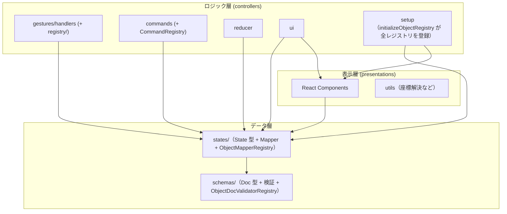

> 🌐 English version: [02-architecture.md](./02-architecture.md)

# アーキテクチャ

`canvas` の内部構造とレイヤー分離。設計判断の背景は
[設計思想](./01-design-philosophy.ja.md) を参照。

## 設計原則

1. **レイヤー分離**: データ層（schemas / states）、ロジック層（controllers）、表示層（presentations）を明確に分離する
2. **一方向依存**: 上位レイヤーは下位レイヤーに依存し、逆方向の依存は禁止する
3. **Registry パターン**: 形状ごとの機能を動的に解決し、拡張性を確保する
4. **State + Mapper の共配置**: 形状ごとにフォルダを作り、State と Mapper をセットで配置する

## ディレクトリ構成

```
packages/canvas/src/
├── index.ts                # パッケージエントリ（Canvas / CanvasDoc / parseCanvasText を re-export）
├── parser.ts               # パーサー専用エントリ（UI 依存なし。VSCode 拡張の Node 側向け）
├── schemas/                # 永続化データ型定義（Doc モデル）+ 構造/意味の検証
│   ├── canvas/
│   │   ├── CanvasDoc.ts
│   │   └── validators/     # parseCanvasText / validateStructure / validateSemantics
│   ├── objects/            # base / primitives / connections / annotations / types + 型別 validateXxxDoc
│   └── registry/           # ObjectDocValidatorRegistry / ShapeFactoryRegistry（+ 初期化）
├── states/                 # ランタイム状態型（State モデル）+ Mapper
│   ├── canvas/             # CanvasState / CanvasMapper / Viewport
│   ├── objects/            # base / primitives / connections / annotations（State + Mapper）
│   └── registry/           # ObjectMapperRegistry / ObjectStateValidatorRegistry
├── controllers/            # 状態管理 + ビジネスロジック
│   ├── Canvas.tsx
│   ├── gestures/           # recognizer（認識）+ handlers + registry/（GestureHandlerRegistry / ObjectBehaviorRegistry）
│   ├── commands/           # Command パターン（selection/arrange/arrow/connector/group/history/text/view）+ CommandRegistry
│   ├── reducer/            # canvasReducer + CanvasActions
│   ├── hooks/              # useCanvasReducer / useSyncExternalDoc など
│   ├── setup/              # initializeObjectRegistry / initializeGestureHandlerRegistry / initializeCommands
│   ├── ui/                 # 変形コントロール・メニュー・アイコンなど UI 制御（ShapePresetRegistry / ObjectMenuRegistry を含む）
│   └── utils/
├── presentations/          # 純粋な描画コンポーネント（layers / objects / defs）
│   └── objects/registry/   # ObjectComponentRegistry / ShapePreviewRegistry
└── constants/              # theme.ts / precision.ts など
```

形状ごと（rect / ellipse / diamond / group / polygon / polyline / connector / sticky / svg）に、
`states/objects/.../<shape>/` と `controllers/gestures/handlers/objects/...`、
`presentations/objects/...` が対応する。

## レイヤー構成と依存関係

### データ層（schemas + states）

- **schemas/**: 永続化データ（ファイル）の型定義（Doc モデル）。木構造を持つ（`GroupDoc` は `children` 配列を持つ）。
- **states/**: ランタイムの状態型（State モデル）+ Mapper。フラット構造（`objects` は ID をキーとした `Record`）に正規化し、編集操作のパフォーマンスを上げる。

依存: `states → schemas`（State は Doc から変換される）。

### ロジック層（controllers）

- **gestures/handlers/**: ジェスチャーを受けて `CanvasState` を更新する。`objects/` 配下に形状ごとの Controller（`moveByDelta` / `transformByGroup`）と EventHandler、`base/` に共通変形ロジック（FrameTransform / PolyTransform / GroupTransform）。
- **commands/**: ショートカット・メニュー・ツールバー共通の操作 → [コマンドシステム](./05-command-system.ja.md)。
- **reducer/**: アクションを各ハンドラへ振り分ける → [状態更新フロー](./06-state-update-flow.ja.md)。
- **ui/**: 変形コントロールやメニューなど UI 制御ロジック。

依存: `controllers → states / schemas`。`controllers → presentations` も存在し、多くは utilities だが、一部の UI コントローラは表示層の**コンポーネント**（例: `PendingConnectorOverlay` → `ConnectorRenderer`、`ArrowHeadIconPreview` → `Arrow`）や presentations 層の `ObjectComponentRegistryContext` も import する。方向（controllers は presentations に依存してよいが逆は禁止）は保たれている。

### 表示層（presentations）

State を Props として受け取り SVG を描画する純粋コンポーネント（Dumb Component）。
ロジック・状態を持たず、イベントハンドラは Props 経由で受け取る → [表示・テーマ](./08-presentation-and-theme.ja.md)。

依存: `presentations → states`（Props の型として参照）。

### レジストリ群（分散型 — 単一の「registry 層」は存在しない）

**トップレベルの `src/registry/` ディレクトリも `ObjectRegistry` クラスも存在しない**。形状ごとの機能は、**それぞれが属するレイヤーに共配置された**複数の小さなレジストリで解決される。

| レジストリクラス                                        | 場所                                          | 解決する対象                                              |
| ------------------------------------------------------- | --------------------------------------------- | --------------------------------------------------------- |
| `ShapeFactoryRegistry`                                  | `schemas/registry/`                           | 型別 ShapeFactory（Doc / bounds 生成）                    |
| `ObjectMapperRegistry` / `ObjectStateValidatorRegistry` | `states/registry/`                            | Doc ↔ State Mapper（+ features）・State バリデータ        |
| `GestureHandlerRegistry` / `ObjectBehaviorRegistry`     | `controllers/gestures/registry/`              | ジェスチャーハンドラ・`moveByDelta` / `transformByGroup`  |
| `ObjectComponentRegistry` / `ShapePreviewRegistry`      | `presentations/objects/registry/`             | 描画コンポーネント・プレビュー描画                        |
| `ShapePresetRegistry` / `ObjectMenuRegistry`            | `controllers/registry/`, `controllers/ui/...` | ShapeLibrary プリセット・型別 ObjectMenu                  |
| `CommandRegistry`                                       | `controllers/commands/`                       | コマンド（[コマンドシステム](./05-command-system.ja.md)） |

各レジストリは形状タイプ（`"rect"`, `"ellipse"` など）をキーにするため、形状横断的な処理を `if (type === ...)` の分岐なしで型安全に書ける。

### canvas 単位のレジストリ（`CanvasConfig`）

これらのレジストリは**モジュールシングルトンではない**。各 `<Canvas>` インスタンスが自前の**バンドル**（`CanvasRegistries`＝各レジストリクラスのインスタンス一式）を持ち、`controllers/setup/createCanvasRegistries(config?)` が生成する。これにより、同一ページ上の2つの canvas を異なる object type / command セットで動かせる（プラグイン的拡張・機能制限）。`config` 未指定時は共有のフルデフォルト（`defaultCanvasRegistries`）を再利用する。

```ts
<Canvas initialConfig={{ objectTypes: ["rect", "ellipse"], commands: ["undo", "redo"] }} />
```

`initialConfig` は **mount 時に一度だけ**読まれる。capability セットは canvas の identity の一部なので、以降の `initialConfig` 変更は無視される。実行時に再構成したい場合は React の `key` を変えて remount する。

バンドルは2経路で消費者に届く（#165・Option B）:

- **React ツリー**（コンポーネント／フック）→ `CanvasRegistriesContext` ＋ `useCanvasRegistries()`。表示層は controllers 層のバンドル型を import できないため、コンポーネントレジストリだけは presentations 層の `ObjectComponentRegistryContext` で配る。
- **純粋な reducer/handler/util ツリー**（React context を読めない）→ バンドルは `CanvasControllerState` には**載せない**（データではなく依存だから）。`createCanvasReducer(registries)` がクロージャで捕捉し、各 handler/command に明示的な `registries` 引数として渡す（`handleGesture(state, gesture, registries)`、`command.execute(state, registries)` など）。`state` を持たない leaf util は該当 sub-registry を引数で受ける。

`initializeObjectRegistry(registries)` / `initializeGestureHandlerRegistry(registries)` / `initializeCommands(registries, commandIds?)` は**渡されたバンドル**を登録し、`createCanvasRegistries` がそれらを配線する（既定は全 object type、または `config` の部分集合）。唯一の例外は `objectDocValidatorRegistry` で、これは schema 層の**グローバル**シングルトンのまま：入力境界のパース時検証でのみ使われ（`<Canvas>` 生成前）、`parseCanvasText` が遅延初期化するのでパーサー専用エントリは UI 依存を引き込まない → [データモデル](./03-data-model-and-persistence.ja.md)。

> **意味論の注意**: `config.objectTypes` で型を絞った場合、呼び出し側は有効な型だけを含む doc を渡す責任を負う。無効な型を含む doc は `canvasToState` が `"Mapper not found"` を throw する（「呼び出し側が valid/consistent な doc を渡す」契約と一致 → [設計思想](./01-design-philosophy.ja.md) 原則4）。既定 config（全型）は後方互換。

> **`CanvasMapper` について**: `CanvasDoc ↔ CanvasState` の全体変換は形状ごとの Mapper を多態的に呼ぶ必要があるため、`states/canvas/CanvasMapper.ts` はグローバル参照ではなく `ObjectMapperRegistry` を引数で受け取る（`canvasToState(doc, mapper)` / `canvasToDoc(state, mapper)`）。呼び出し側が canvas 自身の `registries.objectMapper`（純粋ツリーに通されるバンドル、例: `createInitialControllerState`）を渡す。`states/` 層が依存するレジストリは `ObjectMapperRegistry` のみ（対象の Mapper 群と共配置）なので、レイヤーをまたぐ例外ではない。

## 依存関係グラフ



依存方向は CI でも担保している（[テスト](./09-testing.ja.md) の madge `dep:circle`）。

## 新しい形状の追加手順

Registry パターンにより、形状追加は「6 ステップ + 登録」で完結する。

1. **Schema**: `schemas/objects/primitives/<Shape>Doc.ts`（+ `validate<Shape>Doc.ts`）
2. **State**: `states/objects/primitives/<shape>/<Shape>State.ts`
3. **Mapper**: `states/objects/primitives/<shape>/<Shape>Mapper.ts`（Doc ↔ State）
4. **Controller**: `controllers/gestures/handlers/objects/primitives/<Shape>Controller.ts`（`moveByDelta` / `transformByGroup`）
5. **Component**: `presentations/objects/primitives/<Shape>/<Shape>.tsx`
6. **登録**: 登録先レジストリが分かれているため、**2 箇所**に登録する。
   - `controllers/setup/initializeObjectRegistry.ts` — Mapper / Component / behavior / State バリデータ / menu（UI 側レジストリ群）
   - `schemas/registry/initializeObjectDocValidatorRegistry.ts` — Doc バリデータ。**ここを忘れない**こと。これは `parseCanvasText` が遅延初期化する独立した schema 層レジストリなので、ここに登録し忘れると UI では動くのにパーサーが未知の型として reject する。

既存ロジックの分岐を増やさず、登録だけで形状横断処理（変形・スナップ・描画）に乗る。

## 設計上の禁止事項

- ❌ `states → controllers`（状態定義がロジックに依存してはいけない）
- ❌ `schemas → states`（永続化型がランタイム型に依存してはいけない）
- ❌ `presentations → controllers`（表示がロジックに依存してはいけない）
- ❌ Mapper での再帰処理（Mapper は自身のプロパティのみ変換。子要素の変換は `CanvasMapper` が一元管理）
- ❌ EventHandler での形状判定（`if (type === "rect")` を避け、Registry 経由で解決）
  </content>
