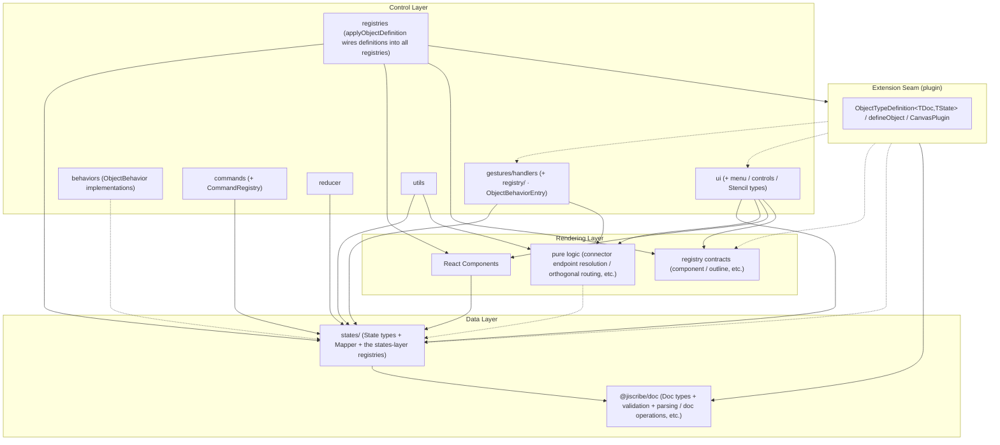

> 🌐 日本語版: [02-architecture.ja.md](./02-architecture.ja.md)

# Architecture

The internal structure and layer separation of `canvas`. For the rationale behind these design decisions, see
[Design Philosophy](./01-design-philosophy.md).

## Design Principles

1. **Layer separation**: Clearly separate, from the bottom up, the data layer (the Doc model in `@jiscribe/doc` plus `states/`), the rendering layer (`rendering/`), and the control layer (`controllers/`). **The control layer is the top layer** — it assembles the rendering layer's components into the screen.
2. **One-way dependency**: Higher layers depend on lower layers; dependencies in the reverse direction are forbidden.
3. **Registry pattern**: Resolve per-shape functionality dynamically to ensure extensibility.
4. **Co-location of State + Mapper**: Create a folder per shape and place the State and Mapper together as a set.

## Directory Structure

Only the main directories are shown (not an exhaustive listing).

```
packages/canvas/src/
├── index.ts                # package entry (the public API: Canvas / CanvasDoc / the parse result types, …)
├── states/                 # runtime state types (State model) + Mapper
│   ├── canvas/             # CanvasState / CanvasMapper
│   ├── objects/            # per-shape State + Mapper
│   └── registry/           # the states layer's registries (ObjectMapperRegistry, …)
├── controllers/            # state management + business logic
│   ├── Canvas.tsx
│   ├── gestures/           # gesture recognition + handlers + their registries (GestureHandlerRegistry / ObjectBehaviorRegistry)
│   ├── behaviors/          # ObjectBehavior implementations (per-type move / transform / rotate)
│   ├── commands/           # Command pattern (a subfolder per kind of operation) + CommandRegistry
│   ├── reducer/            # canvasReducer + CanvasActions
│   ├── hooks/              # useCanvasReducer / useSyncExternalDoc, etc.
│   ├── registries/         # building and wiring the registry bundle (createCanvasRegistries, …)
│   ├── ui/                 # UI control (transform controls, menus, icons) incl. StencilRegistry / ObjectMenuRegistry, among others
│   └── utils/
├── rendering/              # pure rendering components + the Viewport type
│   └── objects/registry/   # the rendering layer's registries (ObjectComponentRegistry, …)
├── plugin/                 # extension seam (ObjectTypeDefinition / defineObject / CanvasPlugin)
└── theme/                  # CanvasTheme / presets / CSS vars + the `theme` token object styles read
```

The Doc model is **not** in this package. It lives in `@jiscribe/doc`
(`packages/doc/src/`), which canvas depends on. Its main parts are `model/` (Doc types + per-type
validation), `plugin/` (`ObjectDocDefinition` / `CanvasDocPlugin` /
`resolveDocDefinitions` / `ObjectDocValidatorRegistry` / `ObjectFactoryRegistry`, …),
`parse/` (`createCanvasParser` / `validateStructure` / `validateSemantics`, …), `ops/`
(`createDocOps`), `text/` (text measurement) and `file/` (`.jis.png` / `.jis.svg`
source embedding). Take all of it from `@jiscribe/doc` — see
[`packages/doc/README.md`](../../doc/README.md).

For each shape there is a corresponding `states/objects/.../<shape>/`,
`controllers/behaviors/...`, and `rendering/objects/...`. The list of core types is
`ObjectTypes` in `@jiscribe/doc`'s `model/objects/types/ObjectType.ts`; every other
shape comes from a plugin → [Plugin Architecture](./12-plugin-architecture.md).

## Layer Composition and Dependencies

### Data Layer (`@jiscribe/doc` + states)

- **`@jiscribe/doc`**: Type definitions for persisted data (files) — the Doc model, in its own package (`packages/doc/src/model/`). It has a tree structure (`GroupDoc` holds a `children` array).
- **states/**: Runtime state types (the State model) + Mapper. Normalized into a flat structure (`objects` is a `Record` keyed by ID) to improve the performance of editing operations.

Dependency: `states → @jiscribe/doc` (State is converted from Doc).

### Rendering Layer

Components that receive State as Props and render SVG. They neither hold nor change the document
or canvas state (local state confined to drawing is allowed), and they take no event handlers:
what can be interacted with is declared through `data-*` attributes (`data-kind` / `data-id` /
`data-part`, …), and the gesture system at the root receives it and dispatches it → [Rendering and Theme](./08-rendering-and-theme.md).
They are assembled by the control layer above them and know nothing of it.

Dependency: `rendering → states / @jiscribe/doc / theme` (types and pure functions from states, doc types such as `EndpointRef` and constants such as `AUTO_COLOR`, and the theme tokens). It does not depend on `controllers`.

### Control Layer

- **gestures/handlers/**: Receive gestures and update `CanvasState`. The per-target EventHandlers sit in subfolders (`objects/`, `controls/`, …), and `handleGesture.ts` dispatches to them.
- **behaviors/**: `ObjectBehavior` implementations registered in `ObjectBehaviorRegistry` (the contract is `ObjectBehaviorEntry` in `gestures/registry/ObjectBehaviorTypes.ts`). Per-type Controllers live under `primitives/` and `connector/`. A type drawn as a frame (e.g. rect / ellipse) has no Controller of its own: its behavior comes from `createFrameBehavior` in `base/FrameController.ts`. The shared transform logic lives under `base/` too. Consumed via the registry from `gestures`, `commands`, `reducer`, and `utils`.
- **commands/**: Operations shared by shortcuts, menus, and the toolbar → [Command System](./05-command-system.md).
- **reducer/**: Dispatches actions to the appropriate handlers → [State Update Flow](./06-state-update-flow.md).
- **ui/**: UI control logic such as transform controls and menus.

Dependencies: `controllers → rendering → states / @jiscribe/doc`. Sitting **above** the rendering layer is why a UI controller importing a rendering **component** (e.g. `PendingConnectorOverlay` → `ConnectorRenderer`, `ArrowHeadIconPreview` → `Arrow`) or a rendering-layer registry context (`RenderingRegistriesProvider`, etc.) is ordinary composition — an upper layer assembling the parts below it — not an exception.

What does remain a structural issue is the pure geometry that lives in the rendering layer. Connector endpoint resolution and orthogonal routing (`rendering/layers/content/utils/endpoints` / `routing`) are consumed not only by `ui` but also by `gestures` (free-endpoint snapping / re-anchoring) and `utils` (freeing endpoints on delete, bounding boxes, visibility); the free-endpoint coordinates persisted on delete go through the same resolution (deliberately, to capture the on-screen position at deletion time). The dependency direction holds, but none of it renders anything — it belongs in a layer below both controllers and rendering.

### Registries (distributed — there is no single "registry" layer)

There is **no top-level `src/registry/` directory and no `ObjectRegistry` class**. Instead, per-shape functionality is resolved through several small registry **classes**, each **colocated with the layer it belongs to**.

The main ones are below. The full set is the bundle each `<Canvas>` owns (`CanvasRegistries` in `controllers/registries/CanvasRegistries.ts`, built in `createCanvasRegistries.ts`); only the doc-validator registry lives outside it (see below).

| Main registry classes                                                                              | Location                                    | Resolves (examples)                                                                                          |
| -------------------------------------------------------------------------------------------------- | ------------------------------------------- | ------------------------------------------------------------------------------------------------------------ |
| `ObjectFactoryRegistry` / `ObjectDocValidatorRegistry`, …                                          | `@jiscribe/doc`, `plugin/`                  | per-type shape factory (create Doc / bounds), Doc validator                                                  |
| `ObjectMapperRegistry` / `ObjectStateValidatorRegistry`, …                                         | `states/registry/`                          | Doc ↔ State mapper (+ features), State validator                                                             |
| `GestureHandlerRegistry` / `ObjectBehaviorRegistry`                                                | `controllers/gestures/registry/`            | gesture handlers, per-type `ObjectBehavior`                                                                  |
| `ObjectComponentRegistry` / `ObjectTextRegionRegistry` / `ObjectOutlineRegistry`, …                | `rendering/objects/registry/`               | render component, editable-text region, hit-test / snap outline                                              |
| `StencilRegistry` / `ObjectMenuRegistry` / `PropertyPanelRegistry` / `SelectionControlRegistry`, … | `controllers/ui/...` (colocated per domain) | StencilLibrary presets, per-type ObjectMenu, per-type properties-sidebar sections, per-type SelectionControl |
| `StylePropertyRegistry`                                                                            | `controllers/styleProperties/`              | style properties (see [Style Property System](./10-style-properties.md))                                     |
| `CommandRegistry`                                                                                  | `controllers/commands/`                     | commands (see [Command System](./05-command-system.md))                                                      |

Because each per-type registry keys off the shape type (`"rect"`, `"ellipse"`, …), cross-shape processing can be written type-safely without `if (type === ...)` branching.

The `StencilRegistry` still only answers "what presets exist". Their arrangement is declared by the host: `toolbar.sections` is the **whole bar** in display order, not the shape tools alone — pinned presets, category flyouts, command buttons, the zoom readout, the sidebar toggles, dividers and finished host UI (`{ type: "slot", id, node }`), grouped into sections each packed against the start or the end of the bar. A host that passes its own therefore restates what it still wants from the default, which is why the default sections are exported apart (the `DEFAULT_TOOLBAR_*_SECTION` constants such as `DEFAULT_TOOLBAR_TOOLS_SECTION`, and `DEFAULT_TOOLBAR_SECTIONS` for all of them in order; the source of truth is `controllers/ui/menu/Toolbar/toolbarSections.ts`). They follow three rules a host is meant to keep: each sidebar toggle sits at the edge its panel opens on, the start side holds what changes the document (shapes, undo / redo) and the end side what does not (zoom, help, host view UI), and only the basic presets are pinned on the bar as shortcuts. Items naming a preset, category or command this canvas does not have are dropped silently, along with the dividers that strands. `stencilLibrary.sections` lists the sections of the **shape library sidebar** — the panel the toggle at the bar's far left opens beside the viewport, which shows every registered stencil grouped and searchable. Both take the same `StencilCategory` shape, and both resolve their `presetIds` against the registry, dropping ids that name nothing and sections left empty. Whether the panel is open and which sections are collapsed are reducer state (`stencilLibraryPanel` (`isOpen` / `collapsedSectionIds`)), driven by the `toggleStencilLibrary` command from the toolbar and by `StencilLibraryPanelHandler` from the panel's own headers and close button. Being a persistent panel, neither field is part of `resetUiState`, so a doc swap leaves it as the user left it. The panel is mounted only while open and takes its width from the viewport (no overlay, no slide). Taking that space moves the viewport's left edge, which would drag the drawing across the screen with it: `useContainerResize` reports the move as `leftEdgeShift` on `CONTAINER_RESIZE` and the reducer takes it off `minX` at the current zoom, so the drawing stays pinned and the panel merely covers and uncovers the strip beside it. The compensation is part of the camera, so the one reported through `onViewportChange` (and read back from `ref.viewport`) carries it while the panel is open: a host that stores that camera and restores it at the next mount with the panel closed sees the drawing sitting the panel's width over the zoom to the side.

The **properties sidebar** is the same mechanism on the other edge, and all the host declares is where its toolbar toggle sits (in the default bar, the `propertyPanelToggle` item of `DEFAULT_TOOLBAR_PROPERTIES_SECTION`; a host that replaces `toolbar.sections` places it again if it wants it). The panel starts closed. Whether it is open and which of its sections are collapsed are reducer state (`propertyPanel` (`isOpen` / `collapsedSectionIds`)), driven by the `togglePropertyPanel` command from the toolbar toggle, from the ellipsis at the end of the ObjectMenu (through `ObjectMenuHandler`) and from the panel's own close button, which routes through `PropertyPanelHandler`. Like the shape library it is outside `resetUiState`, is mounted only while open, and takes its width from the viewport. While it is open the floating ObjectMenu is not rendered: the sidebar states everything the menu does, so the menu would only duplicate it and cover the drawing beside the selection (the menu's gesture handler stays registered, since the sidebar's controls write through it). Sitting on the right it moves the viewport's **right** edge only, so there is nothing to compensate: `useContainerResize` reports the new size with `leftEdgeShift` at 0 and the camera is left alone. It still has to be measured before the paint, so the hook's `layoutKey` covers both panels' open flags. What it draws is per-type like the ObjectMenu: `PropertyPanelRegistry` holds each type's sections (declared as `propertyPanel`, or derived from `features` by `createDefaultPropertyPanel`), and the selection's sections are the ones every selected type offers — `mergeSectionsByKey`, shared with `useMenuSections`, down to the individual row. The connector is the one core type that states its sections by hand rather than deriving them: its Line section ends with a routing row (orthogonal / straight, the sidebar twin of the ObjectMenu's RoutingMenu) and a button that hands the route back to the engine (`resetConnectorRoute`, disabled rather than hidden while the route carries no hand-placed vertices) and it adds two sections for its label — Label for the text and face, Label border for the outline, apart the way a shape's Text and Border are so that a "Width" or "Color" row says which it states — both carrying `isShown` so the headings appear only once the label has text; every row of them would otherwise draw nothing under a standing heading. While nothing is selected it shows a "Canvas" section in place of the per-type ones, editing the document's own settings (`background`); those writes reach the reducer as `DOCUMENT_PROPERTY_UPDATE`. While something is selected, the panel also appends sections of its own, belonging to no type, after the per-type ones, so a connector or a plugin type gets them without declaring them. "Arrange" holds the stacking-order commands as named buttons and shows whenever `isArrangeableSelection` says so (the same test that shows the ObjectMenu's stack-order flyout). "Meta" shows only while the selection names a single object (or a connector) (`isMetaSectionShown`) and edits that object's `meta.name` / `meta.description`. Its writes reach the reducer as `META_PROPERTY_UPDATE`, one of the property routes alongside STYLE / TRANSFORM / DOCUMENT. The value draws nothing, so no re-measure follows, and with a group selected it writes the group's own meta without reaching its children.

### Per-canvas registries (`CanvasConfig`)

These registries are **not module-level singletons**. Each `<Canvas>` instance owns its own **bundle** (`CanvasRegistries` — one instance of each registry class), built by `controllers/registries/createCanvasRegistries(config?)`. This lets two canvases on the same page run with different object-type / command sets (plugin-style extensibility, feature-gating). Passing no `config` reuses a shared full default (`defaultCanvasRegistries`).

```ts
<Canvas initialConfig={{ objectTypes: ["rect", "ellipse"], commands: ["undo", "redo"] }} />
```

`initialConfig` is read **once at mount** — the capability set is part of a canvas's identity, so later `initialConfig` changes are ignored. To reconfigure at runtime, remount with a new React `key`.

The bundle reaches consumers by two paths (#165, Option B):

- **React tree** (components / hooks) → `CanvasRegistriesContext` + `useCanvasRegistries()`. The registries renderers read are distributed through rendering-layer contexts (`ObjectComponentRegistryContext` and its siblings, supplied together by `RenderingRegistriesProvider`), since the rendering layer must not import the control layer's bundle type.
- **Pure reducer/handler/util tree** (cannot read React context) → the bundle is **not** stored on `CanvasControllerState` (it is a dependency, not state). `createCanvasReducer(registries)` closes over it and threads it to each handler/command as an explicit `registries` argument (`handleGesture(state, gesture, registries)`, `command.execute(state, registries)`, …). Leaf utils without `state` receive the specific sub-registry as an argument.

`controllers/registries/createCanvasRegistries` creates the empty registries and fills **that** bundle through the `initialize*` functions (`initializeGestureHandlerRegistry`, `initializeCommands`, …) and a per-type `applyObjectDefinition` (all object types by default, or the `config` subset; the types of `config.plugins` go through the same `applyObjectDefinition`; for the order, see the `createCanvasRegistries` JSDoc). The doc-validator registry is the **exception**: it lives entirely in `@jiscribe/doc`, built per parser by `createCanvasParser` from the definition set it is given, because it is used only during parse-time validation at the input boundary (before a `<Canvas>` exists) and the headless package must pull in no UI dependency — see [Data Model](./03-data-model-and-persistence.md).

> **Semantic caveat**: when `config.objectTypes` restricts the enabled types, the caller must only pass docs whose object types remain enabled. A doc containing a disabled type makes `canvasToState` throw `"Mapper not found"` — consistent with the "caller passes a valid, consistent doc" contract ([design philosophy](./01-design-philosophy.md) principle 4). The default config (all types) is backward compatible.

> **On `CanvasMapper`**: whole-document `CanvasDoc ↔ CanvasState` conversion must invoke each shape's Mapper polymorphically, so `states/canvas/CanvasMapper.ts` takes the registries it needs one by one as arguments (`ObjectMapperRegistry`, …; see `CanvasMapper.ts` for the signatures) rather than reaching for a global — the caller passes the matching ones (`registries.objectMapper`, …) from the canvas's own bundle, the one threaded through the pure tree (e.g. `createInitialControllerState`). Each of them is a states-layer registry under `states/registry/`, so this is not a cross-layer exception.

## Dependency Graph

For a Jiscribe version (layers drawn as frames, easier to read), see [02-architecture.jis.json](./02-architecture.jis.json).
Both draw only the main folders and the main dependencies (not an exhaustive graph). A solid line is a value reference, a dashed line a type-only one.



Direct references to `@jiscribe/doc` types/constants (`EndpointRef`, `AUTO_COLOR`, …) and to `theme/` (the `theme` token object) exist from nearly everywhere, so they are omitted from the graph.

**On `plugin` (the extension seam)**: `plugin/` holds the declarative vocabulary a shape/plugin author writes — `ObjectTypeDefinition<TDoc, TState>`, `defineObject`, `CanvasPlugin`. One definition **aggregates the type contract of every layer** (mapper/state from `states`, doc/features/factory from `@jiscribe/doc`, `ObjectBehaviorEntry` from `gestures/registry`, menu/controls/`Stencil` from `ui`, component/textRegion/outline contracts from `rendering`, and so on), so `plugin` depends on all three layers of this package plus the doc package. Conversely `controllers/registries` depends on `plugin` to build the built-in record (`defineObject`) and apply it (`applyObjectDefinition` → the registries), and `ui`'s properties-panel derivation (`derivePropertyPanel`) calls `plugin`'s predicates as values. At the subgraph level this is a **`controllers ⇄ plugin` mutual reference** — the arrows above cross the Controllers boundary in both directions.

It is deliberately **not** a concrete import cycle: every import `plugin` makes into the other layers of this package is type-only, and none of the modules it reaches imports `plugin` back. The files that use `plugin` as values (`registries/applyObjectDefinition`, `ui`'s `derivePropertyPanel`, …) are different files, which no module `plugin` takes types from imports. So madge `dep:check` stays green even though the folders reference each other. Keeping `applyObjectDefinition` (the runtime wiring) in `registries` rather than `plugin` is what preserves this.

The dependency direction is also checked by tooling: ESLint (`eslint.config.js`) rejects value imports from `rendering` into `controllers` and, inside controllers, from a lower layer into a higher one (the order is `CONTROLLER_LAYERS`), while madge `dep:check` rejects cycles → [Testing](./09-testing.md).

## Steps to Add a New Shape

Adding a core type. Thanks to the Registry pattern, the steps below are all it takes (to add a shape as a plugin, see [Authoring Plugins](./13-authoring-plugins.md)).

1. **Doc**: `@jiscribe/doc`'s `model/objects/primitives/<shape>/<Shape>Doc.ts` (+ `validate<Shape>Doc.ts`, `<Shape>ObjectFactory.ts`). Add the type to the list of core types too (`ObjectTypes` in `model/objects/types/ObjectType.ts`)
2. **State**: `states/objects/primitives/<shape>/<Shape>State.ts`
3. **Mapper**: `states/objects/primitives/<shape>/<Shape>Mapper.ts` (Doc ↔ State)
4. **Behavior**: `controllers/behaviors/primitives/<Shape>Controller.ts` (satisfying `ObjectBehaviorEntry`). A type drawn as a frame needs none: use `createFrameBehavior` from `behaviors/base/FrameController.ts`
5. **Component**: `rendering/objects/primitives/<Shape>/<Shape>.tsx`
6. **Registration**: the definition comes in two tiers, headless and UI, and the UI one takes in the headless one.
   - `@jiscribe/doc`'s `plugin/builtinObjectDocDefinitions.ts` — the headless definition (Doc validator, features, factory, …). The definition set `createCanvasParser` / `createDocOps` use by default is built from it
   - `BUILTIN_OBJECT_DEFINITIONS` in `controllers/registries/applyObjectDefinition.ts` — spreads the definition above (`...builtinObjectDocDefinitions.<shape>`) and adds the UI side: mapper / component / behavior / state validator, and so on. Written on the UI side alone without the spread, the shape works in the UI but the parser strips it as an unknown type
7. **AI schema**: follow "図形を追加するとき" (adding a shape) in [`packages/doc-schema/README.md`](../../doc-schema/README.md) to regenerate the schema and the AI documentation

Without adding branches to existing logic, the shape joins cross-shape processing (transform, snap, rendering) simply by being registered.

## Design Prohibitions

- ❌ `states → controllers` (state definitions must not depend on logic)
- ❌ `@jiscribe/doc → states` (persistence types must not depend on runtime types; the package dependency runs canvas → doc only)
- ❌ `rendering → controllers` (the rendering layer sits below the control layer; it must not depend on the control logic above it)
- ❌ Recursive processing in a Mapper (a Mapper converts only its own properties; conversion of child elements is managed centrally by `CanvasMapper`)
- ❌ Shape discrimination in an EventHandler (avoid `if (type === "rect")`; resolve via the Registry)
