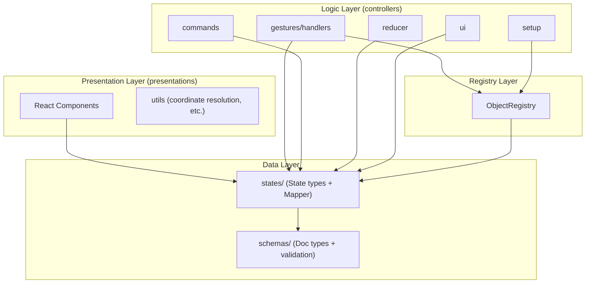

> 🌐 日本語版: [02-architecture.ja.md](./02-architecture.ja.md)

# Architecture

The internal structure and layer separation of `canvas`. For the rationale behind these design decisions, see
[Design Philosophy](./01-design-philosophy.md).

## Design Principles

1. **Layer separation**: Clearly separate the data layer (schemas / states), the logic layer (controllers), and the presentation layer (presentations).
2. **One-way dependency**: Higher layers depend on lower layers; dependencies in the reverse direction are forbidden.
3. **Registry pattern**: Resolve per-shape functionality dynamically to ensure extensibility.
4. **Co-location of State + Mapper**: Create a folder per shape and place the State and Mapper together as a set.

## Directory Structure

```
packages/canvas/src/
├── index.ts                # package entry (re-exports Canvas / CanvasDoc / parseCanvasText)
├── parser.ts               # parser-only entry (no UI dependency; for the Node side of the VSCode extension)
├── schemas/                # persistence data type definitions (Doc model) + structural/semantic validation
│   ├── canvas/
│   │   ├── CanvasDoc.ts
│   │   └── validators/     # parseCanvasText / validateStructure / validateSemantics
│   └── objects/            # base / primitives / types + per-type validateXxxDoc
├── states/                 # runtime state types (State model) + Mapper
│   ├── canvas/             # CanvasState / CanvasMapper / Viewport
│   └── objects/            # base / primitives / connections / annotations (State + Mapper)
├── controllers/            # state management + business logic
│   ├── Canvas.tsx
│   ├── gestures/           # recognizer + handlers (canvas/controls/menu/objects)
│   ├── commands/           # Command pattern (selection/arrange/arrow/group/history/text/view)
│   ├── reducer/            # canvasReducer + CanvasActions
│   ├── hooks/              # useCanvasReducer / useSyncExternalDoc, etc.
│   ├── setup/              # various initialization such as initializeObjectRegistry
│   ├── ui/                 # UI control such as transform controls, menus, and icons
│   └── utils/
├── presentations/          # pure rendering components (layers / objects / defs)
├── registry/               # ObjectRegistry (dynamically resolves per-shape functionality)
└── constants/              # theme.ts / precision.ts, etc.
```

For each shape (rect / ellipse / diamond / group / polygon / polyline / connector / sticky), there is a corresponding
`states/objects/.../<shape>/`, `controllers/gestures/handlers/objects/...`, and
`presentations/objects/...`.

## Layer Composition and Dependencies

### Data Layer (schemas + states)

- **schemas/**: Type definitions for persisted data (files) — the Doc model. It has a tree structure (`GroupDoc` holds a `children` array).
- **states/**: Runtime state types (the State model) + Mapper. Normalized into a flat structure (`objects` is a `Record` keyed by ID) to improve the performance of editing operations.

Dependency: `states → schemas` (State is converted from Doc).

### Logic Layer (controllers)

- **gestures/handlers/**: Receive gestures and update `CanvasState`. Under `objects/` are per-shape Controllers (`moveByDelta` / `transformByGroup`) and EventHandlers, and under `base/` is shared transform logic (FrameTransform / PolyTransform / GroupTransform).
- **commands/**: Operations shared by shortcuts, menus, and the toolbar → [Command System](./05-command-system.md).
- **reducer/**: Dispatches actions to the appropriate handlers → [State Update Flow](./06-state-update-flow.md).
- **ui/**: UI control logic such as transform controls and menus.

Dependencies: `controllers → states / schemas / registry`, and, for utilities only, `controllers → presentations`.

### Presentation Layer (presentations)

Pure components (Dumb Components) that receive State as Props and render SVG.
They hold no logic or state, and receive event handlers via Props → [Presentation and Theme](./08-presentation-and-theme.md).

Dependency: `presentations → states` (referenced as the type of Props).

### Registry Layer

`ObjectRegistry` retrieves `mapper` / `eventHandler` /
`component` / `moveByDelta` / `transformByGroup` / `features` from a shape type (`"rect"`, `"ellipse"`, etc.). This makes it possible to write
cross-shape processing in a type-safe way, without `if (type === ...)` branching.

Dependencies: `registry → states` (type definitions only), `controllers → registry` (dynamic retrieval of functionality).

> **⚠️ The only exception**: Only `states/canvas/CanvasMapper.ts` may reference `registry/ObjectRegistry`.
> Because the whole-document conversion between `CanvasDoc ↔ CanvasState` must call each shape's Mapper polymorphically,
> this dependency is unavoidable by design. Referencing `registry/` from any other `states/` module is forbidden.

## Dependency Graph



The dependency direction is also enforced in CI (madge `dep:circle`, see [Testing](./09-testing.md)).

## Steps to Add a New Shape

Thanks to the Registry pattern, adding a shape is completed in "6 steps + registration."

1. **Schema**: `schemas/objects/primitives/<Shape>Doc.ts` (+ `validate<Shape>Doc.ts`)
2. **State**: `states/objects/primitives/<shape>/<Shape>State.ts`
3. **Mapper**: `states/objects/primitives/<shape>/<Shape>Mapper.ts` (Doc ↔ State)
4. **Controller**: `controllers/gestures/handlers/objects/primitives/<Shape>Controller.ts` (`moveByDelta` / `transformByGroup`)
5. **Component**: `presentations/objects/primitives/<Shape>/<Shape>.tsx`
6. **Registration**: Add it to `controllers/setup/initializeObjectRegistry.ts`

Without adding branches to existing logic, the shape joins cross-shape processing (transform, snap, rendering) simply by being registered.

## Design Prohibitions

- ❌ `states → controllers` (state definitions must not depend on logic)
- ❌ `schemas → states` (persistence types must not depend on runtime types)
- ❌ `presentations → controllers` (presentation must not depend on logic)
- ❌ Recursive processing in a Mapper (a Mapper converts only its own properties; conversion of child elements is managed centrally by `CanvasMapper`)
- ❌ Shape discrimination in an EventHandler (avoid `if (type === "rect")`; resolve via the Registry)
