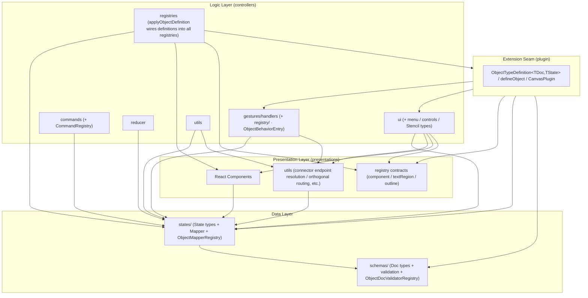

> 🌐 日本語版: [02-architecture.ja.md](./02-architecture.ja.md)

# Architecture

The internal structure and layer separation of `canvas`. For the rationale behind these design decisions, see
[Design Philosophy](./01-design-philosophy.md).

## Design Principles

1. **Layer separation**: Clearly separate the data layer (schemas / states), the logic layer (controllers), and the presentation layer (presentations).
2. **One-way dependency**: Higher layers depend on lower layers; dependencies in the reverse direction are forbidden.
3. **Registry pattern**: Resolve per-shape functionality dynamically to ensure extensibility.
4. **Co-location of State + Mapper**: Create a folder per shape and place the State and Mapper together as a set.

## Directory Structure

```
packages/canvas/src/
├── index.ts                # package entry (re-exports Canvas / CanvasDoc / parseCanvasText)
├── parser.ts               # parser-only entry (no UI dependency; for the Node side of the VSCode extension)
├── schemas/                # persistence data type definitions (Doc model) + structural/semantic validation
│   ├── canvas/
│   │   ├── CanvasDoc.ts
│   │   └── validators/     # parseCanvasText / validateStructure / validateSemantics
│   ├── objects/            # base / primitives / connections / annotations / types + per-type validateXxxDoc
│   └── registry/           # ObjectDocValidatorRegistry / ObjectFactoryRegistry (+ initialization)
├── states/                 # runtime state types (State model) + Mapper
│   ├── canvas/             # CanvasState / CanvasMapper / Viewport
│   ├── objects/            # base / primitives / connections / annotations (State + Mapper)
│   └── registry/           # ObjectMapperRegistry / ObjectStateValidatorRegistry
├── controllers/            # state management + business logic
│   ├── Canvas.tsx
│   ├── gestures/           # recognizer + handlers + registry/ (GestureHandlerRegistry / ObjectBehaviorRegistry)
│   ├── commands/           # Command pattern (selection/arrange/arrow/connector/group/history/text/view) + CommandRegistry
│   ├── reducer/            # canvasReducer + CanvasActions
│   ├── hooks/              # useCanvasReducer / useSyncExternalDoc, etc.
│   ├── registries/         # initializeObjectRegistry / initializeGestureHandlerRegistry / initializeCommands
│   ├── ui/                 # UI control (transform controls, menus, icons) incl. StencilRegistry / ObjectMenuRegistry
│   └── utils/
├── presentations/          # pure rendering components (layers / objects / defs)
│   └── objects/registry/   # ObjectComponentRegistry / ObjectTextRegionRegistry / ObjectOutlineRegistry
├── plugin/                 # extension seam (ObjectTypeDefinition / defineObject / CanvasPlugin)
└── constants/              # theme.ts / precision.ts, etc.
```

For each shape (rect / ellipse / diamond / group / polygon / polyline / connector / sticky / svg), there is a corresponding
`states/objects/.../<shape>/`, `controllers/gestures/handlers/objects/...`, and
`presentations/objects/...`.

## Layer Composition and Dependencies

### Data Layer (schemas + states)

- **schemas/**: Type definitions for persisted data (files) — the Doc model. It has a tree structure (`GroupDoc` holds a `children` array).
- **states/**: Runtime state types (the State model) + Mapper. Normalized into a flat structure (`objects` is a `Record` keyed by ID) to improve the performance of editing operations.

Dependency: `states → schemas` (State is converted from Doc).

### Logic Layer (controllers)

- **gestures/handlers/**: Receive gestures and update `CanvasState`. Under `objects/` are per-shape Controllers (`moveByDelta` / `transformByGroup`) and EventHandlers, and under `base/` is shared transform logic (FrameTransform / PolyTransform / GroupTransform).
- **commands/**: Operations shared by shortcuts, menus, and the toolbar → [Command System](./05-command-system.md).
- **reducer/**: Dispatches actions to the appropriate handlers → [State Update Flow](./06-state-update-flow.md).
- **ui/**: UI control logic such as transform controls and menus.

Dependencies: `controllers → states / schemas`. `controllers → presentations` also exists. Most of it is utility references, chiefly connector endpoint resolution / orthogonal routing (`presentations/layers/content/utils/endpoints` / `routing`) — consumed not only by `ui` but also by `gestures` (free-endpoint snapping / re-anchoring) and `utils` (freeing endpoints on delete, bounding boxes, visibility). The free-endpoint coordinates persisted on delete go through this same resolution (deliberately, to capture the on-screen position at deletion time). Some UI controllers additionally import presentation **components** (e.g. `PendingConnectorOverlay` → `ConnectorRenderer`, `ArrowHeadIconPreview` → `Arrow`) and the presentation-layer registry contexts (`PresentationRegistriesProvider`, etc.). The direction (controllers may depend on presentations, never the reverse) still holds.

### Presentation Layer (presentations)

Pure components (Dumb Components) that receive State as Props and render SVG.
They hold no logic or state, and receive event handlers via Props → [Presentation and Theme](./08-presentation-and-theme.md).

Dependency: `presentations → states / schemas` (State as the type of Props, plus schema types such as `EndpointRef` and constants such as `AUTO_COLOR`).

### Registries (distributed — there is no single "registry" layer)

There is **no top-level `src/registry/` directory and no `ObjectRegistry` class**. Instead, per-shape functionality is resolved through several small registry **classes**, each **colocated with the layer it belongs to**:

| Registry class                                                                   | Location                                    | Resolves                                                               |
| -------------------------------------------------------------------------------- | ------------------------------------------- | ---------------------------------------------------------------------- |
| `ObjectFactoryRegistry`                                                          | `schemas/registry/`                         | per-type shape factory (create Doc / bounds)                           |
| `ObjectMapperRegistry` / `ObjectStateValidatorRegistry`                          | `states/registry/`                          | Doc ↔ State mapper (+ features), State validator                       |
| `GestureHandlerRegistry` / `ObjectBehaviorRegistry`                              | `controllers/gestures/registry/`            | gesture handlers, `moveByDelta` / `transformByGroup`                   |
| `ObjectComponentRegistry` / `ObjectTextRegionRegistry` / `ObjectOutlineRegistry` | `presentations/objects/registry/`           | render component, editable-text region, hit-test / snap outline        |
| `StencilRegistry` / `ObjectMenuRegistry` / `SelectionControlRegistry`            | `controllers/ui/...` (colocated per domain) | StencilLibrary presets, per-type ObjectMenu, per-type SelectionControl |
| `CommandRegistry`                                                                | `controllers/commands/`                     | commands (see [Command System](./05-command-system.md))                |

Because each registry keys off the shape type (`"rect"`, `"ellipse"`, …), cross-shape processing can be written type-safely without `if (type === ...)` branching.

### Per-canvas registries (`CanvasConfig`)

These registries are **not module-level singletons**. Each `<Canvas>` instance owns its own **bundle** (`CanvasRegistries` — one instance of each registry class), built by `controllers/registries/createCanvasRegistries(config?)`. This lets two canvases on the same page run with different object-type / command sets (plugin-style extensibility, feature-gating). Passing no `config` reuses a shared full default (`defaultCanvasRegistries`).

```ts
<Canvas initialConfig={{ objectTypes: ["rect", "ellipse"], commands: ["undo", "redo"] }} />
```

`initialConfig` is read **once at mount** — the capability set is part of a canvas's identity, so later `initialConfig` changes are ignored. To reconfigure at runtime, remount with a new React `key`.

The bundle reaches consumers by two paths (#165, Option B):

- **React tree** (components / hooks) → `CanvasRegistriesContext` + `useCanvasRegistries()`. The presentation-layer `ObjectComponentRegistryContext` distributes just the component registry to renderers (presentation must not import the controllers-layer bundle type).
- **Pure reducer/handler/util tree** (cannot read React context) → the bundle is **not** stored on `CanvasControllerState` (it is a dependency, not state). `createCanvasReducer(registries)` closes over it and threads it to each handler/command as an explicit `registries` argument (`handleGesture(state, gesture, registries)`, `command.execute(state, registries)`, …). Leaf utils without `state` receive the specific sub-registry as an argument.

`controllers/registries/initializeObjectRegistry(registries)` / `initializeGestureHandlerRegistry(registries)` / `initializeCommands(registries, commandIds?)` populate a **given** bundle; `createCanvasRegistries` wires them together (all object types by default, or the `config` subset). The **exception** is `objectDocValidatorRegistry`, which stays a schema-layer **global** singleton: it is used only during parse-time validation at the input boundary (before a `<Canvas>` exists), so `parseCanvasText` initializes it lazily and the parser-only entry pulls in no UI dependency — see [Data Model](./03-data-model-and-persistence.md).

> **Semantic caveat**: when `config.objectTypes` restricts the enabled types, the caller must only pass docs whose object types remain enabled. A doc containing a disabled type makes `canvasToState` throw `"Mapper not found"` — consistent with the "caller passes a valid, consistent doc" contract ([design philosophy](./01-design-philosophy.md) principle 4). The default config (all types) is backward compatible.

> **On `CanvasMapper`**: whole-document `CanvasDoc ↔ CanvasState` conversion must invoke each shape's Mapper polymorphically, so `states/canvas/CanvasMapper.ts` takes an `ObjectMapperRegistry` argument (`canvasToState(doc, mapper)` / `canvasToDoc(state, mapper)`) rather than reaching for a global — the caller passes the canvas's own `registries.objectMapper` (the bundle threaded through the pure tree, e.g. `createInitialControllerState`). `ObjectMapperRegistry` is the only registry the `states/` layer depends on (colocated with the mappers it serves), so this is not a cross-layer exception.

## Dependency Graph

For a Jiscribe version (layers drawn as frames, easier to read), see [02-architecture.jis.json](./02-architecture.jis.json).



Direct references to schema types/constants (`EndpointRef`, `AUTO_COLOR`, …) and to `constants/` (theme, etc.) exist from nearly everywhere, so they are omitted from the graph.

**On `plugin` (the extension seam)**: `plugin/` holds the declarative vocabulary a shape/plugin author writes — `ObjectTypeDefinition<TDoc, TState>`, `defineObject`, `CanvasPlugin`. One definition **aggregates the type contract of every layer** (mapper/state from `states`, doc/features/factory from `schemas`, `ObjectBehaviorEntry` from `gestures/registry`, menu/controls/`Stencil` from `ui`, component/textRegion/outline contracts from `presentations`), so `plugin` depends on all four layers. Conversely `controllers/registries` depends on `plugin` to build the built-in record (`defineObject`) and apply it (`applyObjectDefinition` → the registries). At the subgraph level this is a **`controllers ⇄ plugin` mutual reference** — the arrows above cross the Controllers boundary in both directions.

It is deliberately **not** a concrete import cycle: `plugin` pulls only leaf _type_ modules (`ObjectBehaviorTypes` / `SelectionControlTypes` / `ObjectMenuTypes` / `Stencil`), while the files that consume `plugin` (`registries/initializeObjectRegistry` and friends) are different files that none of those leaf modules import back. So madge `dep:circle` stays green even though the folders reference each other. Keeping `applyObjectDefinition` (the runtime wiring) in `registries` rather than `plugin` is what preserves this: `plugin` never imports the concrete registries.

The dependency direction is also enforced in CI (madge `dep:circle`, see [Testing](./09-testing.md)).

## Steps to Add a New Shape

Thanks to the Registry pattern, adding a shape is completed in "6 steps + registration."

1. **Schema**: `schemas/objects/primitives/<Shape>Doc.ts` (+ `validate<Shape>Doc.ts`)
2. **State**: `states/objects/primitives/<shape>/<Shape>State.ts`
3. **Mapper**: `states/objects/primitives/<shape>/<Shape>Mapper.ts` (Doc ↔ State)
4. **Controller**: `controllers/gestures/handlers/objects/primitives/<Shape>Controller.ts` (`moveByDelta` / `transformByGroup`)
5. **Component**: `presentations/objects/primitives/<Shape>/<Shape>.tsx`
6. **Registration**: Register it in **both** registration paths, because they populate different registry sets:
   - `controllers/registries/initializeObjectRegistry.ts` — mapper / component / behavior / state validator / menu (the UI-side registries)
   - `schemas/registry/initializeObjectDocValidatorRegistry.ts` — the Doc validator. **Do not forget this one**: it is a separate, schema-layer registry populated lazily by `parseCanvasText`, so a shape missing here is rejected by the parser as an unknown type even though the UI works.

Without adding branches to existing logic, the shape joins cross-shape processing (transform, snap, rendering) simply by being registered.

## Design Prohibitions

- ❌ `states → controllers` (state definitions must not depend on logic)
- ❌ `schemas → states` (persistence types must not depend on runtime types)
- ❌ `presentations → controllers` (presentation must not depend on logic)
- ❌ Recursive processing in a Mapper (a Mapper converts only its own properties; conversion of child elements is managed centrally by `CanvasMapper`)
- ❌ Shape discrimination in an EventHandler (avoid `if (type === "rect")`; resolve via the Registry)
