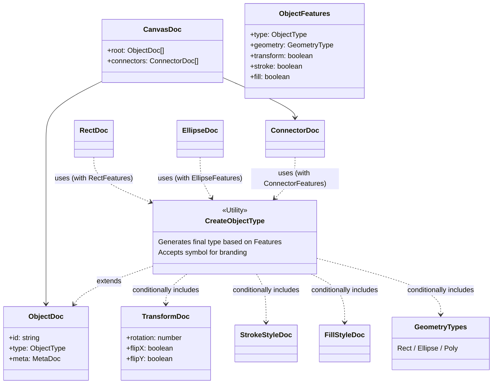

# Schemas

This directory holds the definitions (schemas) for persisted data structures.
It leverages TypeScript's type system to automatically compose object types based on feature flags (`ObjectFeatures`).

**Note:** Branded Types are used to distinguish Doc types from State types. This prevents direct mutual assignment and forces conversion through explicit mapper functions (`states/objects/**/XxxMapper.ts`).

## Directory Structure

| Directory        | Description                                                                                                                                    |
| ---------------- | ---------------------------------------------------------------------------------------------------------------------------------------------- |
| `canvas/`        | Defines the root structure of the entire canvas (`CanvasDoc`).                                                                                 |
| `objects/`       | Individual object definitions, classified into `base` (common), `primitives` (basic shapes), `connections` (lines/arrows), `annotations`, etc. |
| `objects/types/` | Defines the enums and shared types used by objects (`ObjectType`, `GeometryType`, etc.) and the type-composition utility (`CreateObjectType`). |
| `objects/utils/` | Runtime helpers that assist in generating and validating Docs (`createObjectDoc`, `autoColor`, `validateDocUtils`, etc.).                      |
| `registry/`      | Manages the per-type doc validator and ShapeFactory registry and its initialization (`initializeObjectDocValidatorRegistry`).                  |

## Type Composition Architecture

Rather than manually defining every property, each object (Rect, Ellipse, etc.) is generated by composing the required features (Geometry, Transform, Fill, Stroke) using the `CreateObjectType` utility.



## Usage Example

To add a new object type:

1. Define `ObjectFeatures`, enabling the required features (including the `type` field).
2. Declare a brand with a `unique symbol`.
3. Generate the type using `CreateObjectType`.

```typescript
// Example: RectDoc.ts
export const RectFeatures = {
	type: "rect",
	geometry: "rect",
	transform: true,
	stroke: true,
	fill: true,
} as const satisfies ObjectFeatures;

// eslint-disable-next-line @typescript-eslint/no-unused-vars
declare const RectDocBrand: unique symbol;

export type RectDoc = CreateObjectType<
	typeof RectFeatures,
	typeof RectDocBrand
>;
```

The corresponding State type is placed under `states/objects/` and generated using `CreateObjectState`.
For converting between Doc and State, use the mapper functions in each shape's folder at `states/objects/**/XxxMapper.ts`.
