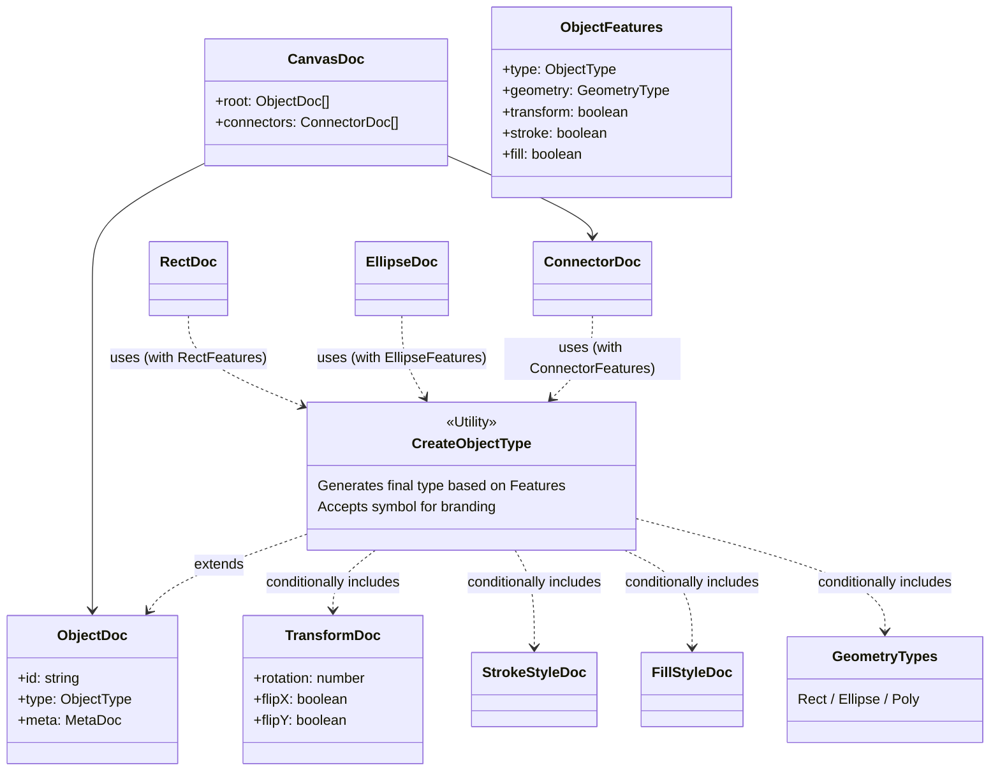

# Schemas

永続化するデータ構造の定義（スキーマ）を管理するディレクトリです。
TypeScriptの型システムを活用し、機能フラグ（`ObjectFeatures`）に基づいてオブジェクトの型を自動合成する設計になっています。

**Note:** Branded Types を使用して Doc 型と State 型を区別しています。直接の相互代入を防ぎ、明示的なマッパー関数（`states/objects/**/XxxMapper.ts`）を通じた変換を強制します。

## Directory Structure

| Directory        | Description                                                                                                                                 |
| ---------------- | ------------------------------------------------------------------------------------------------------------------------------------------- |
| `canvas/`        | キャンバス全体のルート構造 (`CanvasDoc`) を定義します。                                                                                     |
| `objects/`       | 個別のオブジェクト定義。`base`（共通）, `primitives`（基本図形）, `connections`（線・矢印）, `annotations`（注釈）等に分類されます。        |
| `objects/types/` | オブジェクトで使用される列挙型や共有型 (`ObjectType`, `GeometryType` 等) と、型を合成するユーティリティ (`CreateObjectType`) を定義します。 |
| `objects/utils/` | Doc の生成・検証を支援するランタイムヘルパ (`createObjectDoc`, `autoColor`, `validateDocUtils` 等) です。                                   |
| `registry/`      | 型ごとの doc バリデータ・ShapeFactory のレジストリと、その初期化 (`initializeObjectDocValidatorRegistry`) を管理します。                    |

## Type Composition Architecture

各オブジェクト（Rect, Ellipse等）は、手動ですべてのプロパティを定義するのではなく、`CreateObjectType` ユーティリティを使用して必要な機能（Geometry, Transform, Fill, Stroke）を合成して生成されます。



## Usage Example

新しいオブジェクトタイプを追加する場合：

1. `ObjectFeatures` を定義して、必要な機能を有効にします（`type`フィールドを含む）。
2. `unique symbol` でブランドを宣言します。
3. `CreateObjectType` を使って型を生成します。

```typescript
// Example: RectDoc.ts
export const RectFeatures = {
	type: "rect",
	geometry: "rect",
	transform: true,
	stroke: true,
	fill: true,
} as const satisfies ObjectFeatures;

// eslint-disable-next-line @typescript-eslint/no-unused-vars
declare const RectDocBrand: unique symbol;

export type RectDoc = CreateObjectType<
	typeof RectFeatures,
	typeof RectDocBrand
>;
```

対応する State 型は `states/objects/` に配置し、`CreateObjectState` を使用して生成します。
Doc と State の変換には、各図形フォルダの `states/objects/**/XxxMapper.ts` にあるマッパー関数を使用してください。
