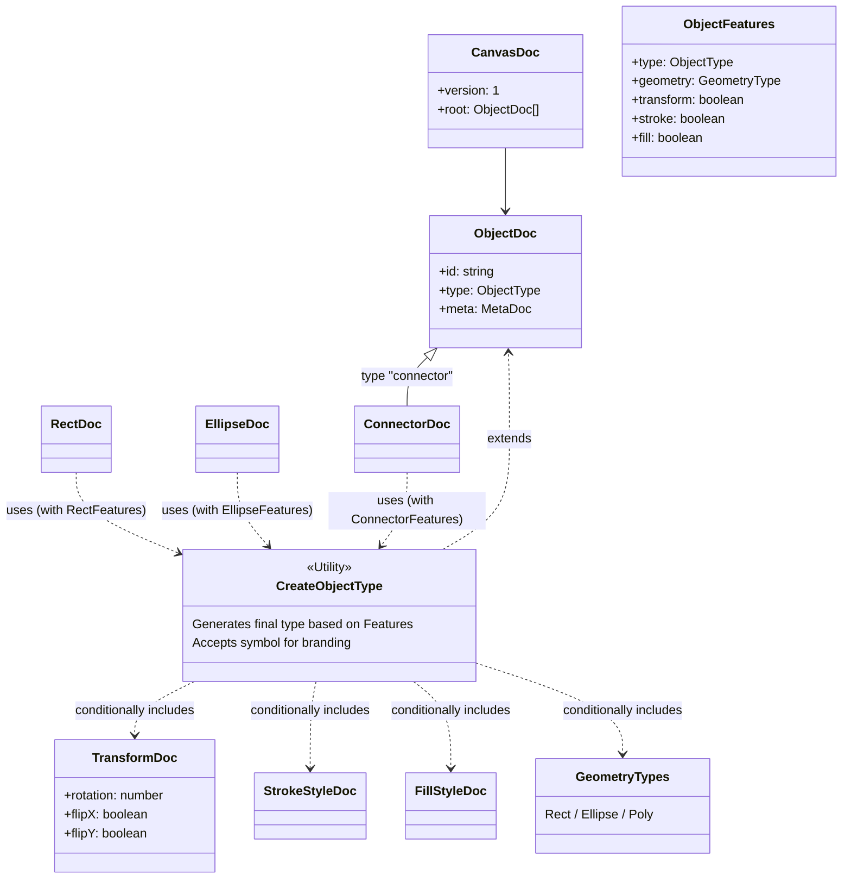

> 🌐 English version: [README.md](./README.md)

# @jiscribe/doc

jiscribe キャンバスのドキュメントモデル。保存される `CanvasDoc` とそのオブジェクト型、
テキストを `CanvasDoc` に変えるパーサー、プログラムから組み立て・作り替えを行う ops を
持つ。全体がヘッドレスで、react / @emotion も、canvas の rendering / control / state の
各層も import しない。そのため Node 側のホスト（VSCode 拡張の DiagnosticProvider、MCP
サーバー、`@jiscribe/doc-tools`、CLI）は UI を連れてこずにドキュメントモデルだけを使える。

## エントリポイント

| エントリ                   | 説明                                                                                              |
| -------------------------- | ------------------------------------------------------------------------------------------------- |
| `@jiscribe/doc`            | 安定 API: doc の型、`createCanvasParser`、`createDocOps`、`builtinObjectDocDefinitions`           |
| `@jiscribe/doc/unstable`   | プラグイン作者が frame 族の型を作るための実装詳細（doc ファクトリ・doc バリデータ・テキスト計測） |
| `@jiscribe/doc/png-source` | `.jis.png` の iTXt へのソース埋め込み・取り出し                                                   |
| `@jiscribe/doc/svg-source` | `.jis.svg` の `<metadata>` からのソース取り出し・差し替え                                         |

`@jiscribe/canvas` は `./doc`・`./unstable-doc`・`./png-source`・`./svg-source` を
これらへの再エクスポートとして残してあるので、利用者は 1 つずつ移行できる。

## ディレクトリ構成

| ディレクトリ  | 説明                                                                                                                                                                                                                                                                                                |
| ------------- | --------------------------------------------------------------------------------------------------------------------------------------------------------------------------------------------------------------------------------------------------------------------------------------------------- |
| `model/`      | 保存されるデータ構造と型ごとの意味 — 下記参照                                                                                                                                                                                                                                                       |
| `plugin/`     | doc 側のプラグイン契約: `ObjectDocDefinition`（1 つの型のバリデータ + features + ファクトリ）、`CanvasDocPlugin`、定義から読む述語（`supportsAutoHeight` / `hasInsetTextRegion`）、組み込み定義表、そして preset とプラグインの定義をパーサーと ops が使う 1 つの表に束ねる `resolveDocDefinitions` |
| `registries/` | その定義を集めて型で引く器: doc バリデータ・ファクトリ・スタイル既定値の各レジストリ                                                                                                                                                                                                                |
| `parse/`      | `createCanvasParser` と、それが走らせる段階的な検証（`migrate/migrateDoc` → `stripUnknownContent` → `checkStructure` → レジストリの型ごとの検証と `validateDocKeys` → `checkSemantics` → 報告した未知キーの削除）                                                                                   |
| `ops/`        | `createDocOps` — doc をプログラムから組み立て・作り替える（`ops/README.md` 参照）                                                                                                                                                                                                                   |
| `text/`       | テキスト計測と視覚行のレイアウト、および表示・編集・計測が一致していなければならないタイポグラフィ定数                                                                                                                                                                                              |
| `file/`       | `.jis.png` / `.jis.svg` へのソース埋め込みと取り出し                                                                                                                                                                                                                                                |

canvas 側での `plugin/` の相方は canvas 自身の `plugin/` フォルダで、表示側の契約
（`ObjectTypeDefinition`）を持つ。UI 定義は構造的に doc 定義でもある。

## model/

このディレクトリは保存されるデータ構造の定義を持つ。TypeScript の型システムを使い、
feature フラグ（`ObjectFeatures`）からオブジェクト型を自動的に組み立てる。

**注:** Doc 型と State 型は Branded Type で区別している。直接の相互代入を防ぎ、明示的な
mapper 関数（`@jiscribe/canvas` の `states/objects/**/XxxMapper.ts`）を通した変換を強制
するため。

| ディレクトリ          | 説明                                                                                                                                                                                                                                                                                                |
| --------------------- | --------------------------------------------------------------------------------------------------------------------------------------------------------------------------------------------------------------------------------------------------------------------------------------------------- |
| `canvas/`             | キャンバス全体のルート構造（`CanvasDoc`）を定義する。                                                                                                                                                                                                                                               |
| `objects/`            | 個々のオブジェクト定義。`base`（型をまたいで共有するフィールド群）・`primitives`（基本図形）・`connector`（線・矢印）に分かれる。これ以外の図形はプラグインとして出荷され、ここには無い。                                                                                                           |
| `objects/types/`      | オブジェクトが使う enum と共有型（`ObjectType`・`GeometryType` など）、および型合成ユーティリティ（`CreateObjectType`）を定義する。                                                                                                                                                                 |
| `objects/types/text/` | そのうちテキストに関わる型: 本文とは何か（`RichText`）、それを描くタイポグラフィ（`TextBaseStyle` と `TextEmphasisStyle`。合わせて 1 つの run が持てる `InlineTextStyle`）、テキストが入るスロット（`TextSlot`）、型がテキストをどう持つか（`TextType`）。型だけで、計測とレイアウトは `../text/`。 |
| `objects/utils/`      | Doc の生成を助けるランタイムヘルパー（`createObjectDoc`・`autoColor`・`roundDocNumbers` など）。                                                                                                                                                                                                    |
| `objects/validators/` | doc のフィールド群ごとの検査 — 幾何・transform・スタイル・テキスト・端点・poly — と、`features` に従ってそれらを組み合わせる `createFrameDocValidator`。各 `validateXxxDoc` はこれらの上に建つ。型が持てるフィールド _名_ を決めるのはレジストリの側。                                              |
| `types/`              | doc 層全体で共有する語彙: `SemanticDiagnostic`（すべての `validateXxxDoc` が返す診断であり、パース結果の通貨）。                                                                                                                                                                                    |

テキストを `CanvasDoc` にするのはここではなく `../parse/` で、これらの定義からレジストリ
を組み立てて段階的な検証を走らせる。この層は型を定義し、1 つずつ検証するだけ — パース段階
を持たない canvas の `states/` と対称になっている。

## 型合成アーキテクチャ

すべてのプロパティを手で定義する代わりに、各オブジェクト（Rect・Ellipse など）は必要な
feature（Geometry・Transform・Fill・Stroke）を `CreateObjectType` ユーティリティで合成して
生成する。



## オブジェクト型を宣言する

型が持つフィールドは 2 つに分かれる。`features` が導くもの（ジオメトリの座標・スタイル
グループ・テキストグループ）は導出されるので、どの型も宣言しない。それ以外はその型固有の
もので、`XxxDoc` 型がその置き場になる。

```typescript
// 例: CalloutDoc.ts
export type CalloutDoc = CreateObjectType<
	typeof CalloutFeatures,
	typeof CalloutDocBrand,
	{ tail: Point }
>;

/** callout が features の外に持つ doc フィールド。 */
export const CALLOUT_EXTRA_KEYS = [
	"tail",
] as const satisfies readonly (keyof CalloutDoc)[];
```

`satisfies` が一覧を doc 型に縛り、一覧はここ以外には書かない。これを型の
`ObjectDocDefinition` の `extraKeys` に設定する。「その型が持つキー」の宣言はこの 1 つ
だけで、読み手は 3 つ。どれも自前の一覧を持たない。

| 読み手                                             | 名前をどう使うか                                                                                                                       |
| -------------------------------------------------- | -------------------------------------------------------------------------------------------------------------------------------------- |
| パーサー（`checkStructure` → `validateDocKeys`）   | レジストリが `features` + `extraKeys` から組み立てた許可キー集合に doc を照らし、それ以外の名前を warning で報告して `ok.doc` から除く |
| Mapper（`createFrameMapper` / `createPolyMapper`） | doc ↔ state 間でちょうどこれらを受け渡す                                                                                               |
| doc-ops（`extraProps`）                            | 呼び出し側が書いてよい名前としてちょうどこれらを受け付ける。構造として扱うキー（group の `children`）は除く                            |

`validateDoc` はこの一覧に入らない。型のバリデータは自分が持つ値と、その型だけが知る規則を
検査するもので、どの名前を持てるかは関知しないし、許可リストを渡されることもない。おかげで
検査はすべての登録済みの型で一様になる — `createFrameDocValidator` をまったく通らない poly
族も含めて。

1 段下でも同じ。doc が入れ子にする器 — テキストの run・スロット・poly の頂点・コネクターの
端点・アンカー・label — はこのパッケージが形を決めるもので、それぞれ型の隣にキーの一覧を持つ
（`TEXT_RUN_KEYS`・`TEXT_SLOT_KEYS`・`CONNECTOR_LABEL_KEYS`・`ANCHOR_SPEC_KEYS_BY_KIND` …）。
パーサーは型の `features` からそれらを辿る（`parse/validateDocKeys.ts`）。型が `extraKeys`
で宣言する入れ子のオブジェクト（callout の `tail`）は辿らない。Mapper が値を丸ごと通すので中の
何も失われず、値の検査は型のバリデータの仕事になる。

2 つが食い違ったときに何が起きるか。`XxxDoc` にフィールドを足して `extraKeys` に足し忘れる
と、そのフィールドはパーサーに未知として報告され、返される文書から取り除かれる。つまり次の
保存で値が消える。`satisfies` はこれを防がない — 一覧に型が持たない名前が無いことしか言えず、
すべてを持っていることは言えないからだ。出荷型については `@jiscribe/doc-tools` の
`shippedPropertyNames` テストが、公開 JSON スキーマとレジストリを突き合わせて検出する。

## 旧形式の移行

形式が昔書いていて今は書かないフィールドは、何かを検証する前にパーサーが書き換える。だから
古いビルドが書いた文書も開く。移行は `parse/migrate/migrateDoc.ts` の 1 つの表にあり、どれも
1 つのオブジェクトから書き換え後のオブジェクトと、書き換えた内容の warning を返す純粋な関数。

- **版で切り分けず、常に走る。**文書は手がかりになる世代を持たない（プラグイン構成はホスト
  ごとに違う）ので、移行は旧形式を**形だけで**見分け、そうでなければ何もしない。移行済みの
  文書を移行しても何も変わらないのはこれによるもので、毎回走らせられる理由もこれ。
- **書き換えはすべて `warning`。**`ok.warnings` の先頭に並び、オブジェクトが id を持てば
  それも載る。`ok.doc` は移行後の doc なので、黙って変わることはなく、次の保存で今の形式が書かれる。
- **未登録の型には触れない。**不透明オブジェクトの中身はここで読むものではない。

形式に破壊的変更を入れるときに従う規律がこれ。**新しい形式は、旧形式と形だけで見分けられるように
設計し、一方を他方へ変える移行を書く。**そう見分けられない変更には書ける移行が無く、旧形式を持つ
文書はすべて誰かが手で直すファイルになる。

表が持つのは文書全体の移行で、どの型のオブジェクトもここを通る。1 つの型だけが要る移行は
その型の `ObjectDocDefinition` のフックにし、表の後にオブジェクトごとに適用することになる。
今のところ要るものが無いのでフックは無い。

## 使用例

新しいオブジェクト型を足すには:

1. `ObjectFeatures` を定義し、必要な feature を有効にする（`type` フィールドを含む）。
2. `unique symbol` でブランドを宣言する。
3. `CreateObjectType` で型を生成する。

```typescript
// 例: RectDoc.ts
export const RectFeatures = {
	type: "rect",
	geometry: "rect",
	transform: true,
	stroke: true,
	fill: true,
} as const satisfies ObjectFeatures;

// eslint-disable-next-line @typescript-eslint/no-unused-vars
declare const RectDocBrand: unique symbol;

export type RectDoc = CreateObjectType<
	typeof RectFeatures,
	typeof RectDocBrand
>;
```

対応する State 型は `@jiscribe/canvas` の `states/objects/` にあり、`CreateObjectState`
で生成する。Doc と State の変換には、各図形のフォルダにある
`states/objects/**/XxxMapper.ts` の mapper 関数を使う。
