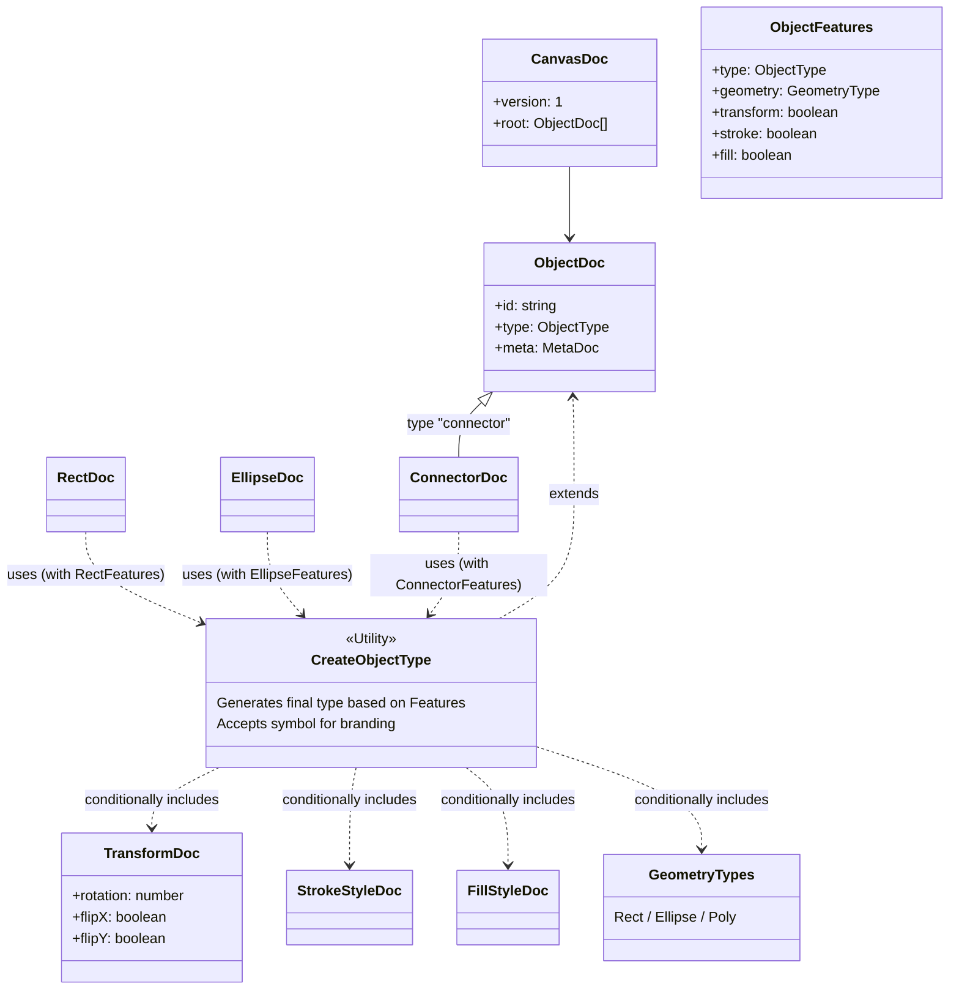

# @jiscribe/doc

The document model of a jiscribe canvas: the persisted `CanvasDoc` and its object
types, the parser that turns a text into one, and the ops that build and rework one
programmatically. Headless throughout — nothing here imports react / @emotion or the
canvas rendering, control and state layers, so a Node host (the VSCode extension's
DiagnosticProvider, the MCP server, `@jiscribe/doc-tools` and the CLI) takes the doc
model without the UI coming with it.

## Entry points

| Entry                      | Description                                                                                                       |
| -------------------------- | ----------------------------------------------------------------------------------------------------------------- |
| `@jiscribe/doc`            | The stable API: doc types, `createCanvasParser`, `createDocOps`, `builtinObjectDocDefinitions`                    |
| `@jiscribe/doc/unstable`   | Implementation details plugin authors build frame-family types with (doc factories, doc validators, text metrics) |
| `@jiscribe/doc/png-source` | `.jis.png` iTXt source embedding / extraction                                                                     |
| `@jiscribe/doc/svg-source` | `.jis.svg` `<metadata>` source extraction / replacement                                                           |

`@jiscribe/canvas` keeps `./doc`, `./unstable-doc`, `./png-source` and `./svg-source`
as re-export shims onto these, so consumers can migrate one at a time.

## Directory structure

| Directory | Description                                                                                                                                                                                   |
| --------- | --------------------------------------------------------------------------------------------------------------------------------------------------------------------------------------------- |
| `model/`  | The persisted data structures and their per-type semantics — see below                                                                                                                        |
| `plugin/` | The doc-side plugin contract: `ObjectDocDefinition` (one type's validator + features + factory), `CanvasDocPlugin`, `resolveDocDefinitions`, the registries and the built-in definition table |
| `parse/`  | `createCanvasParser` and the staged validation it runs                                                                                                                                        |
| `ops/`    | `createDocOps` — programmatic building and reworking of a doc (see `ops/README.md`)                                                                                                           |
| `text/`   | Text measurement and visual line layout, plus the typography constants display, editing and measurement must agree on                                                                         |
| `file/`   | `.jis.png` / `.jis.svg` source embedding and extraction                                                                                                                                       |

The counterpart of `plugin/` on the canvas side is its own `plugin/` folder, which
holds the presentation contract (`ObjectTypeDefinition`); a UI definition is
structurally a doc definition.

## model/

This directory holds the definitions for persisted data structures.
It leverages TypeScript's type system to automatically compose object types based on feature flags (`ObjectFeatures`).

**Note:** Branded Types are used to distinguish Doc types from State types. This prevents direct mutual assignment and forces conversion through explicit mapper functions (`@jiscribe/canvas`, `states/objects/**/XxxMapper.ts`).

| Directory        | Description                                                                                                                                             |
| ---------------- | ------------------------------------------------------------------------------------------------------------------------------------------------------- |
| `canvas/`        | Defines the root structure of the entire canvas (`CanvasDoc`).                                                                                          |
| `objects/`       | Individual object definitions, classified into `base` (common), `primitives` (basic shapes), `connector` (lines/arrows), `annotations`, etc.            |
| `objects/types/` | Defines the enums and shared types used by objects (`ObjectType`, `GeometryType`, etc.) and the type-composition utility (`CreateObjectType`).          |
| `objects/utils/` | Runtime helpers that assist in generating and validating Docs (`createObjectDoc`, `autoColor`, `validateDocUtils`, etc.).                               |
| `types/`         | Vocabulary shared across the whole doc layer: `SemanticDiagnostic`, the diagnostic every `validateXxxDoc` returns and the currency of the parse result. |

Turning a text into a `CanvasDoc` is not here but in `../parse/`, which composes a
registry from these definitions and runs the staged validation. This layer only defines
the types and validates them one at a time — symmetric with the canvas's `states/`,
which has no parse stage either.

## Type Composition Architecture

Rather than manually defining every property, each object (Rect, Ellipse, etc.) is generated by composing the required features (Geometry, Transform, Fill, Stroke) using the `CreateObjectType` utility.



## Usage Example

To add a new object type:

1. Define `ObjectFeatures`, enabling the required features (including the `type` field).
2. Declare a brand with a `unique symbol`.
3. Generate the type using `CreateObjectType`.

```typescript
// Example: RectDoc.ts
export const RectFeatures = {
	type: "rect",
	geometry: "rect",
	transform: true,
	stroke: true,
	fill: true,
} as const satisfies ObjectFeatures;

// eslint-disable-next-line @typescript-eslint/no-unused-vars
declare const RectDocBrand: unique symbol;

export type RectDoc = CreateObjectType<
	typeof RectFeatures,
	typeof RectDocBrand
>;
```

The corresponding State type lives in `@jiscribe/canvas` under `states/objects/` and is generated using `CreateObjectState`.
For converting between Doc and State, use the mapper functions in each shape's folder at `states/objects/**/XxxMapper.ts`.
