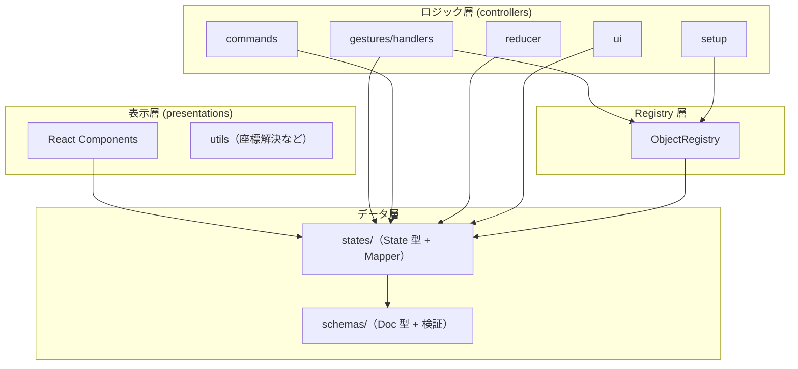

# アーキテクチャ

`svg-canvas-2` の内部構造とレイヤー分離。設計判断の背景は
[設計思想](./01-design-philosophy.md) を参照。

## 設計原則

1. **レイヤー分離**: データ層（schemas / states）、ロジック層（controllers）、表示層（presentations）を明確に分離する
2. **一方向依存**: 上位レイヤーは下位レイヤーに依存し、逆方向の依存は禁止する
3. **Registry パターン**: 形状ごとの機能を動的に解決し、拡張性を確保する
4. **State + Mapper の共配置**: 形状ごとにフォルダを作り、State と Mapper をセットで配置する

## ディレクトリ構成

```
packages/svg-canvas-2/src/
├── index.ts                # パッケージエントリ（Canvas / CanvasDoc / parseCanvasText を re-export）
├── parser.ts               # パーサー専用エントリ（UI 依存なし。VSCode 拡張の Node 側向け）
├── schemas/                # 永続化データ型定義（Doc モデル）+ 構造/意味の検証
│   ├── canvas/
│   │   ├── CanvasDoc.ts
│   │   └── validators/     # parseCanvasText / validateStructure / validateSemantics
│   └── objects/            # base / primitives / types + 型別 validateXxxDoc
├── states/                 # ランタイム状態型（State モデル）+ Mapper
│   ├── canvas/             # CanvasState / CanvasMapper / Viewport
│   └── objects/            # base / primitives / connections / annotations（State + Mapper）
├── controllers/            # 状態管理 + ビジネスロジック
│   ├── Canvas.tsx
│   ├── gestures/           # recognizer（認識）+ handlers（canvas/controls/menu/objects）
│   ├── commands/           # Command パターン（selection/arrange/arrow/group/history/text/view）
│   ├── reducer/            # canvasReducer + CanvasActions
│   ├── hooks/              # useCanvasReducer / useSyncExternalDoc など
│   ├── setup/              # initializeObjectRegistry など各種初期化
│   ├── ui/                 # 変形コントロール・メニュー・アイコンなど UI 制御
│   └── utils/
├── presentations/          # 純粋な描画コンポーネント（layers / objects / defs）
├── registry/               # ObjectRegistry（形状ごとの機能を動的解決）
└── constants/              # theme.ts / precision.ts など
```

形状ごと（rect / ellipse / group / polygon / polyline / connector / sticky）に、
`states/objects/.../<shape>/` と `controllers/gestures/handlers/objects/...`、
`presentations/objects/...` が対応する。

## レイヤー構成と依存関係

### データ層（schemas + states）

- **schemas/**: 永続化データ（ファイル）の型定義（Doc モデル）。木構造を持つ（`GroupDoc` は `children` 配列を持つ）。
- **states/**: ランタイムの状態型（State モデル）+ Mapper。フラット構造（`objects` は ID をキーとした `Record`）に正規化し、編集操作のパフォーマンスを上げる。

依存: `states → schemas`（State は Doc から変換される）。

### ロジック層（controllers）

- **gestures/handlers/**: ジェスチャーを受けて `CanvasState` を更新する。`objects/` 配下に形状ごとの Controller（`moveByDelta` / `transformByGroup`）と EventHandler、`base/` に共通変形ロジック（FrameTransform / PolyTransform / GroupTransform）。
- **commands/**: ショートカット・メニュー・ツールバー共通の操作 → [コマンドシステム](./05-command-system.md)。
- **reducer/**: アクションを各ハンドラへ振り分ける → [状態更新フロー](./06-state-update-flow.md)。
- **ui/**: 変形コントロールやメニューなど UI 制御ロジック。

依存: `controllers → states / schemas / registry`、および utilities に限り `controllers → presentations`。

### 表示層（presentations）

State を Props として受け取り SVG を描画する純粋コンポーネント（Dumb Component）。
ロジック・状態を持たず、イベントハンドラは Props 経由で受け取る → [表示・テーマ](./08-presentation-and-theme.md)。

依存: `presentations → states`（Props の型として参照）。

### Registry 層

`ObjectRegistry` は形状タイプ（`"rect"`, `"ellipse"` など）から `mapper` / `eventHandler` /
`component` / `moveByDelta` / `transformByGroup` / `features` を取得する。これにより
形状横断的な処理を `if (type === ...)` の分岐なしで型安全に書ける。

依存: `registry → states`（型定義のみ）、`controllers → registry`（機能の動的取得）。

> **⚠️ 唯一の例外**: `states/canvas/CanvasMapper.ts` のみ `registry/ObjectRegistry` を参照してよい。
> `CanvasDoc ↔ CanvasState` の全体変換は形状ごとの Mapper を多態的に呼び出す必要があるため、
> この依存は設計上不可避。他の `states/` から `registry/` を参照することは禁止。

## 依存関係グラフ



依存方向は CI でも担保している（[テスト](./09-testing.md) の madge `dep:circle`）。

## 新しい形状の追加手順

Registry パターンにより、形状追加は「6 ステップ + 登録」で完結する。

1. **Schema**: `schemas/objects/primitives/<Shape>Doc.ts`（+ `validate<Shape>Doc.ts`）
2. **State**: `states/objects/primitives/<shape>/<Shape>State.ts`
3. **Mapper**: `states/objects/primitives/<shape>/<Shape>Mapper.ts`（Doc ↔ State）
4. **Controller**: `controllers/gestures/handlers/objects/primitives/<Shape>Controller.ts`（`moveByDelta` / `transformByGroup`）
5. **Component**: `presentations/objects/primitives/<Shape>/<Shape>.tsx`
6. **登録**: `controllers/setup/initializeObjectRegistry.ts` に追加

既存ロジックの分岐を増やさず、登録だけで形状横断処理（変形・スナップ・描画）に乗る。

## 設計上の禁止事項

- ❌ `states → controllers`（状態定義がロジックに依存してはいけない）
- ❌ `schemas → states`（永続化型がランタイム型に依存してはいけない）
- ❌ `presentations → controllers`（表示がロジックに依存してはいけない）
- ❌ Mapper での再帰処理（Mapper は自身のプロパティのみ変換。子要素の変換は `CanvasMapper` が一元管理）
- ❌ EventHandler での形状判定（`if (type === "rect")` を避け、Registry 経由で解決）
  </content>
