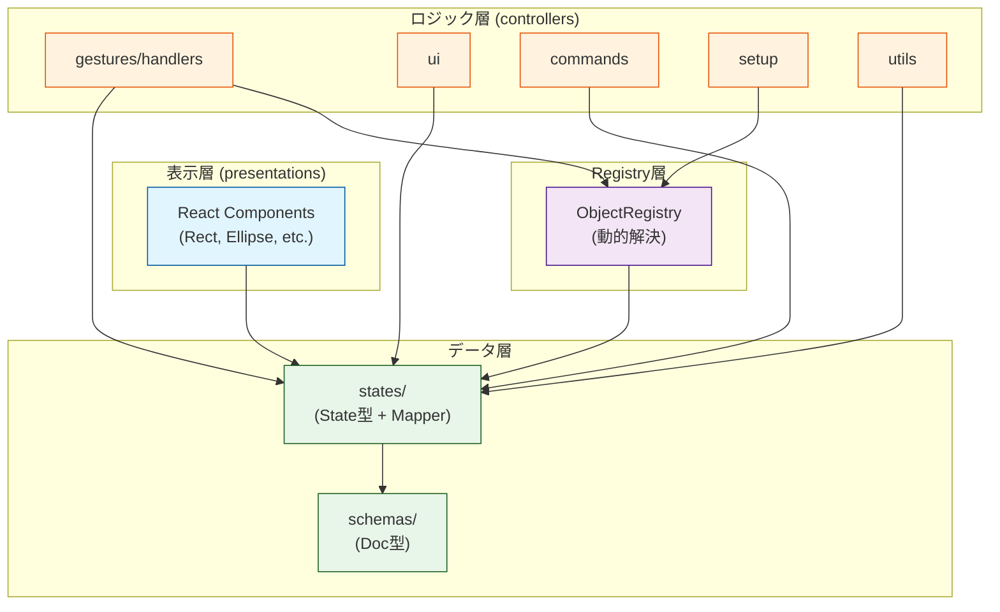

# svg-canvas-2 アーキテクチャ

`svg-canvas-2` パッケージの内部構造と設計思想についてのドキュメントです。

## 設計原則

1. **レイヤー分離**: データ層（states）、ロジック層（controllers）、表示層（presentations）を明確に分離
2. **依存関係の一方向性**: 上位レイヤーは下位レイヤーに依存し、逆方向の依存は禁止
3. **Registry パターン**: 形状ごとの機能を動的に解決し、拡張性を確保
4. **State + Mapper の共配置**: 形状ごとにフォルダを作り、State と Mapper をセットで配置

## ディレクトリ構成

```
packages/svg-canvas-2/src/
├── schemas/                         # 永続化データ型定義（Docモデル）
│   ├── canvas/
│   │   └── CanvasDoc.ts             # Canvas全体のドキュメント型
│   └── objects/
│       ├── base/                    # 基底型
│       │   ├── ObjectDoc.ts
│       │   ├── MetaDoc.ts
│       │   └── TransformDoc.ts
│       └── primitives/              # 形状ごとの型定義
│           ├── RectDoc.ts
│           ├── EllipseDoc.ts
│           ├── GroupDoc.ts
│           ├── PolygonDoc.ts
│           └── PolylineDoc.ts
│
├── states/                          # ランタイム状態型定義（Stateモデル）+ Mapper
│   ├── canvas/
│   │   ├── CanvasState.ts           # フラット化されたCanvas状態
│   │   ├── CanvasMapper.ts          # Doc ↔ State 変換
│   │   ├── Viewport.ts
│   │   └── __tests__/               # Mapperのテスト
│   │       └── CanvasMapper.test.ts
│   └── objects/
│       ├── base/                    # 基底型 + Mapper
│       │   ├── ObjectState.ts
│       │   ├── ObjectMapper.ts
│       │   ├── MetaState.ts
│       │   ├── MetaMapper.ts
│       │   ├── TransformState.ts
│       │   ├── TransformMapper.ts
│       │   └── __tests__/
│       ├── primitives/              # 形状ごとのフォルダ（State + Mapper）
│       │   ├── rect/
│       │   │   ├── RectState.ts
│       │   │   ├── RectMapper.ts
│       │   │   └── __tests__/
│       │   ├── ellipse/
│       │   │   ├── EllipseState.ts
│       │   │   ├── EllipseMapper.ts
│       │   │   └── __tests__/
│       │   ├── group/
│       │   │   ├── GroupState.ts
│       │   │   ├── GroupMapper.ts
│       │   │   └── __tests__/
│       │   ├── polygon/
│       │   │   ├── PolygonState.ts
│       │   │   ├── PolygonMapper.ts
│       │   │   └── __tests__/
│       │   └── polyline/
│       │       ├── PolylineState.ts
│       │       ├── PolylineMapper.ts
│       │       └── __tests__/
│       ├── connections/
│       │   └── connector/
│       │       ├── ConnectorState.ts
│       │       ├── ConnectorMapper.ts
│       │       └── __tests__/
│       └── annotations/
│           └── sticky/
│               ├── StickyState.ts
│               ├── StickyMapper.ts
│               └── __tests__/
│
├── controllers/                     # 状態管理 + ビジネスロジック
│   ├── Canvas.tsx                   # メインキャンバスコンポーネント
│   ├── CanvasStyled.ts
│   ├── gestures/                    # ジェスチャー認識 + 操作ロジック
│   │   ├── handlers/
│   │   │   ├── canvas/              # キャンバス全体のイベント
│   │   │   ├── controls/            # 変形コントロール
│   │   │   │   └── transform/
│   │   │   │       ├── TransformControlHandler.ts
│   │   │   │       └── utils/
│   │   │   ├── menu/                # メニュー操作
│   │   │   └── objects/             # オブジェクト操作
│   │   │       ├── base/            # 共通変形ロジック
│   │   │       │   ├── FrameTransform.ts     # Frame系変形
│   │   │       │   ├── PolyTransform.ts      # Poly系変形
│   │   │       │   └── GroupTransform.ts     # Group再帰変形
│   │   │       ├── primitives/      # 形状ごとの状態更新ロジック
│   │   │       │   ├── RectController.ts     # moveByDelta, transformByGroup
│   │   │       │   ├── RectEventHandler.ts   # イベントハンドラー
│   │   │       │   ├── EllipseController.ts
│   │   │       │   ├── EllipseEventHandler.ts
│   │   │       │   ├── GroupController.ts    # transformChildren含む
│   │   │       │   ├── GroupEventHandler.ts
│   │   │       │   ├── PolylineController.ts
│   │   │       │   └── PolylineEventHandler.ts
│   │   │       ├── connections/
│   │   │       │   └── ConnectorController.ts
│   │   │       ├── annotations/
│   │   │       │   └── StickyController.ts
│   │   │       └── utils/           # EventHandler共通ロジック
│   │   │           ├── FrameDragEventHandler.ts
│   │   │           ├── PolyDragEventHandler.ts
│   │   │           ├── DefaultClickEventHandler.ts
│   │   │           ├── determineSelection.ts
│   │   │           └── getAncestors.ts
│   │   └── recognizer/              # ジェスチャー認識
│   ├── commands/                    # コマンドパターン（Undo/Redo）
│   ├── hooks/                       # カスタムフック
│   ├── reducer/                     # 状態管理reducer
│   ├── setup/                       # 初期化処理
│   │   └── initializeObjectRegistry.ts
│   ├── ui/                          # UI制御
│   │   ├── controls/                # 変形コントロールUI
│   │   ├── feedback/                # ビジュアルフィードバック
│   │   ├── menu/                    # メニューUI
│   │   ├── icons/                   # アイコン
│   │   └── utils/                   # UI関連ユーティリティ
│   │       ├── calcGroupBoundingBox.ts
│   │       ├── calculateGroupOrientedBounds.ts
│   │       ├── updateGroupBounds.ts
│   │       └── getResizeCursorForRotation.ts
│   └── utils/                       # 共通ユーティリティ
│       └── normalizeRotation.ts
│
├── presentations/                   # 表示コンポーネント（純粋な描画）
│   ├── layers/
│   ├── objects/
│   │   ├── primitives/
│   │   │   ├── Rect.tsx
│   │   │   ├── Ellipse.tsx
│   │   │   ├── Polygon.tsx
│   │   │   └── Polyline.tsx
│   │   ├── connections/
│   │   │   └── Connector.tsx
│   │   └── annotations/
│   │       └── Sticky.tsx
│   └── controls/
│
├── registry/                        # レジストリパターン
│   ├── ObjectRegistry.ts            # 形状ごとの機能を動的解決
│   └── ObjectRegistryTypes.ts       # 型定義
│
└── constants/
    └── precision.ts
```

## レイヤー構成と依存関係

### 1. データ層（schemas + states）

**役割**: データ構造の定義

- **schemas/**: 永続化データ（ファイル、DB）の型定義（Doc モデル）
  - 木構造を持つ（GroupDoc は children 配列を持つ）
  - ファイルI/Oで使用

- **states/**: ランタイムの状態型定義（State モデル）+ Mapper
  - フラット構造（objects は ID をキーとした Map）
  - 編集操作のパフォーマンス向上のため正規化
  - **Mapper**: Doc ↔ State の相互変換を担当
  - **共配置**: 形状ごとに State + Mapper + テストをセットで配置

**依存関係**:
- states → schemas（StateはDocから変換される）

### 2. ロジック層（controllers）

**役割**: 状態管理とビジネスロジック

- **gestures/handlers/objects/**: オブジェクト操作ロジック
  - **base/**: 共通変形ロジック（FrameTransform, PolyTransform, GroupTransform）
  - **primitives/*Controller.ts**: 形状ごとの状態更新関数
    - `moveByDelta`: 平行移動
    - `transformByGroup`: 親グループ変形時の子の変換
  - **primitives/*EventHandler.ts**: イベントハンドラー
    - onDragStart, onDrag, onDragEnd, onClick

- **gestures/handlers/controls/**: 変形コントロールロジック
  - リサイズ、回転、グループ変形など

- **ui/**: UI制御ロジック
  - バウンディングボックス計算
  - カーソル制御など

**依存関係**:
- controllers → states（状態の型を参照）
- controllers → schemas（一部でDoc型を参照）
- controllers → registry（動的な機能解決）

### 3. 表示層（presentations）

**役割**: 純粋な描画コンポーネント

- State を Props として受け取り、SVG 要素を描画
- ロジックを持たず、表示のみに専念
- **特徴**:
  - 状態管理を行わない（Dumb Component）
  - イベントハンドラーは Props 経由で受け取る

**依存関係**:
- presentations → states（Props の型として参照）

### 4. Registry 層

**役割**: 形状ごとの機能を動的に解決

- **ObjectRegistry**: 形状タイプ（"rect", "ellipse" など）から以下を取得
  - `mapper`: Doc ↔ State 変換関数
  - `eventHandler`: イベントハンドラー
  - `component`: React コンポーネント
  - `moveByDelta`: 平行移動関数
  - `transformByGroup`: グループ変形関数
  - `features`: 形状の特性（geometry, transform, stroke, fill など）

- **メリット**:
  - 新しい形状の追加が容易（initializeObjectRegistry に登録するだけ）
  - 形状横断的な処理を型安全に実装可能
  - 依存関係の逆転（registry は具体的な実装に依存しない）

**依存関係**:
- registry → states（型定義のみ）
- controllers → registry（機能の動的取得）

## 依存関係グラフ



## 主要な設計パターン

### 1. State + Mapper の共配置

形状ごとにフォルダを作成し、State と Mapper をセットで配置:

```
states/objects/primitives/rect/
├── RectState.ts      # State型定義
├── RectMapper.ts     # Doc ↔ State 変換
└── __tests__/
    └── RectMapper.test.ts
```

**メリット**:
- 関連ファイルが近くにある（検索しやすい）
- 形状追加時に必要なファイルが明確
- テストも同じ場所に配置

### 2. Registry パターンによる動的解決

形状横断的な処理を Registry 経由で動的に解決:

```typescript
// GroupController.ts
export function transformChildren(
    rootGroupStart: GroupState,
    rootGroupEnd: GroupState,
    targetGroup: GroupState,
    allObjects: Record<string, ObjectState>
): Record<string, ObjectState> {
    const transformed = {} as Record<string, ObjectState>;

    for (const childId of targetGroup.childIds) {
        const child = allObjects[childId];

        // Registry経由で形状ごとのtransform関数を取得
        const transformByGroup = objectRegistry.getTransformByGroup(child.type);

        if (transformByGroup) {
            transformed[childId] = transformByGroup(child, rootGroupStart, rootGroupEnd);
        }

        // 再帰処理
        if (child.type === "group") {
            const nestedTransformed = transformChildren(
                rootGroupStart,
                rootGroupEnd,
                child as GroupState,
                allObjects
            );
            Object.assign(transformed, nestedTransformed);
        }
    }

    return transformed;
}
```

**メリット**:
- if-else の分岐不要
- 新しい形状追加時にロジック変更不要
- 型安全

### 3. 共通変形ロジックの抽出

3つの変形パターンを共通関数として実装:

1. **FrameTransform**: Frame系（Rect, Ellipse, Group）の変形
   - 中心点、サイズ、回転、スケールを変換

2. **PolyTransform**: Poly系（Polygon, Polyline）の変形
   - 各頂点を変換（TODO: 実装予定）

3. **GroupTransform**: Group の再帰変形
   - FrameTransform を使用し、子要素も再帰的に変形

各 Controller は適切な共通関数を使用:

```typescript
// EllipseController.ts
export const transformByGroup: TransformByGroupFunction<EllipseState> = (
    state,
    groupStart,
    groupEnd,
) => {
    return transformFrameByGroup(
        state,
        groupStart as GroupState,
        groupEnd as GroupState,
    );
};
```

## 新しい形状の追加方法

1. **Schema 定義**: `schemas/objects/primitives/NewShapeDoc.ts`
2. **State 定義**: `states/objects/primitives/newshape/NewShapeState.ts`
3. **Mapper 実装**: `states/objects/primitives/newshape/NewShapeMapper.ts`
4. **Controller 実装**: `controllers/gestures/handlers/objects/primitives/NewShapeController.ts`
   - moveByDelta
   - transformByGroup
5. **EventHandler 実装**: `controllers/gestures/handlers/objects/primitives/NewShapeEventHandler.ts`
6. **Component 実装**: `presentations/objects/primitives/NewShape.tsx`
7. **Registry 登録**: `controllers/setup/initializeObjectRegistry.ts`

## 設計上の禁止事項

❌ **禁止される依存関係**:
- states → controllers（状態定義がロジックに依存してはいけない）
- schemas → states（永続化型がランタイム型に依存してはいけない）
- presentations → controllers（表示がロジックに依存してはいけない）

❌ **Mapper での再帰処理禁止**:
- Mapper は自身のプロパティのみを変換
- 子要素の変換は CanvasMapper が一元管理

❌ **EventHandler での形状判定禁止**:
- if (child.type === "rect") のような分岐を避ける
- Registry 経由で動的に解決

## まとめ

svg-canvas-2 は以下の原則に基づいて設計されています:

1. **レイヤー分離**: データ、ロジック、表示を明確に分離
2. **一方向依存**: 下位レイヤーから上位レイヤーへの依存のみ
3. **共配置**: 関連ファイルを近くに配置（State + Mapper）
4. **動的解決**: Registry パターンで形状ごとの機能を型安全に解決
5. **拡張性**: 新しい形状の追加が容易

この設計により、保守性、拡張性、テスタビリティの高いコードベースを実現しています。
