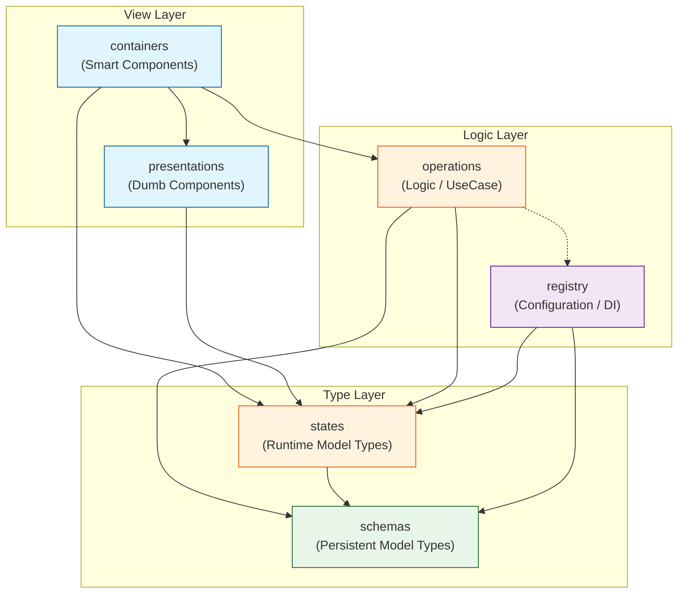

# アーキテクチャ構成メモ

`svg-canvas-2` パッケージの内部構造と依存関係についてのメモです。

## ディレクトリ構成と役割

| ディレクトリ        | 役割               | 説明                                                                                               |
| ------------------- | ------------------ | -------------------------------------------------------------------------------------------------- |
| **`schemas`**       | Model / Types      | アプリケーションのデータ構造、型定義、バリデーションロジック。依存の末端。                         |
| **`states`**        | State Definition   | アプリケーションの状態定義（型）。`presentations` などで型として利用される。                       |
| **`operations`**    | Logic / UseCase    | 状態に対する操作、ビジネスロジック。`states` を更新する役割を持つ。                                |
| **`registry`**      | Configuration      | ツールや図形タイプなどの拡張可能な要素を登録・管理する仕組み。                                     |
| **`presentations`** | View (Dumb)        | 純粋な表示コンポーネント。`states` の型（Props）を受け取り描画する。                               |
| **`containers`**    | Controller / Smart | 状態の管理を行い、`presentations` を利用して画面を描画する。アプリケーションの「画面」を構成する。 |

## 依存関係 (Mermaid)

データの流れと参照の方向性を示します。
基本原則として、**上位のレイヤーは下位のレイヤーに依存し、逆方向の依存は禁止**します。

## 実装のポイント

- **`states`, `schemas` は純粋な型定義**
  - これらはロジックを持たず、データの形状のみを定義する。
- **`presentations` は `states` に依存する**
  - `presentations` は描画に必要なデータの型定義として `states` を参照する。ただし、状態の管理や更新ロジックは持たず、Props経由でデータを受け取る。
- **`presentations` は `schemas` を知らない**
  - ドメインモデルに直接依存せず、必要なプリミティブな値や、`presentations` 層で定義された型のみを受け取るようにして疎結合を保つ（推奨）。
- **`containers` が接着剤**
  - `hook` 等を使って `states` からデータを取り出し、`operations` の関数をコールバックとして `presentations` に渡す役割を一手に引き受ける。
- **`operations` は純粋なロジック**
  - UIに関心を持たず、状態の変更のみに注力する。
