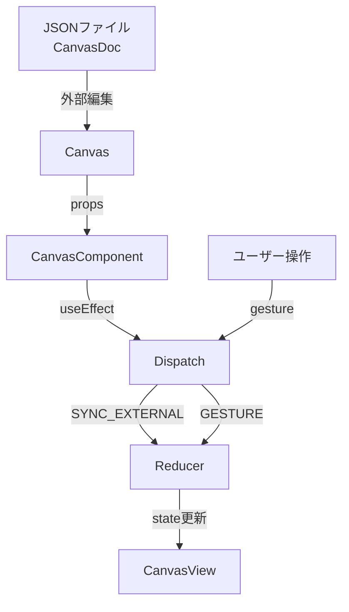

# 外部更新の反映メカニズム

このドキュメントでは、`svg-canvas-2` パッケージにおける外部からの `CanvasDoc` 更新を反映する仕組みについて説明します。

## 背景と要件

### ユースケース

このパッケージはVSCode拡張機能として使用される想定で、以下のようなシナリオが考えられます：

1. **ユーザーがキャンバス上でオブジェクトを操作** → アプリ内部で状態更新
2. **ユーザーやAIがJSONファイルを直接編集** → 外部からの更新を検知して反映
3. **複数の編集ソースが同時に存在** → 競合を適切に管理

### 設計上の課題

- `useReducer` の `initialState` は初回レンダリング時のみ使用され、その後の変更は反映されない
- 外部更新と内部操作による更新を区別し、適切に同期する必要がある
- UI状態（選択、ドラッグ中など）は外部更新で失われないようにする

## 現在の実装

### アーキテクチャ概要



### 実装の詳細

#### 1. Reducerでの外部更新アクション

**ファイル**: `src/controllers/canvasReducer.ts`

```typescript
export type CanvasAction =
	| { type: "GESTURE"; gesture: Gesture }
	| { type: "SYNC_EXTERNAL"; payload: CanvasState };

export const canvasReducer = (
	state: CanvasState,
	action: CanvasAction,
): CanvasState => {
	switch (action.type) {
		case "GESTURE":
			return handleGesture(state, action.gesture);

		case "SYNC_EXTERNAL":
			// 外部更新を反映（選択状態とドラッグ状態は保持）
			return {
				...action.payload,
				selectedIds: state.selectedIds,
				dragging: state.dragging,
			};

		default:
			return state;
	}
};
```

**設計判断**:
- ドキュメント構造（`objects`, `rootIds` など）は外部更新で完全に上書き
- UI状態（`selectedIds`, `dragging`）は現在の状態を保持
- これにより、ユーザーが選択操作中でも外部更新が反映される

#### 2. Canvasコンポーネントでの同期

**ファイル**: `src/controllers/Canvas.tsx`

```typescript
const CanvasComponent: React.FC<CanvasProps> = ({ canvasDoc }) => {
	const initialState = useMemo((): CanvasState => {
		const baseState = canvasToState(canvasDoc);
		return {
			...baseState,
			selectedIds: [],
			dragging: null,
		};
	}, [canvasDoc]);

	const [state, dispatch] = useReducer(canvasReducer, initialState);

	// 外部からのcanvasDoc更新を検知して同期
	useEffect(() => {
		const newState = canvasToState(canvasDoc);
		dispatch({ type: "SYNC_EXTERNAL", payload: newState });
	}, [canvasDoc]);

	// ... 以下省略
};
```

**動作フロー**:
1. `canvasDoc` propsが変更される
2. `useEffect`が発火し、`SYNC_EXTERNAL`アクションをdispatch
3. Reducerが新しいドキュメント構造を反映しつつUI状態を保持
4. コンポーネントが再レンダリングされ、新しい状態が表示される

### 現在の制約

#### 状態保持の挙動

- **保持される状態**: `selectedIds`, `dragging`
- **上書きされる状態**: `objects`, `rootIds`

#### 潜在的な問題

1. **選択されたオブジェクトが削除された場合**
   - 現在は選択IDがそのまま保持されるため、存在しないオブジェクトを選択している状態になる可能性がある
   - レンダリング時に参照エラーは起きないが、論理的に不整合

2. **ドラッグ中のオブジェクトが削除された場合**
   - 同様に、ドラッグ状態が保持されるため不整合が発生する可能性

## 今後の拡張ポイント

### 1. 削除されたオブジェクトの選択解除

#### 目的
外部更新で選択中のオブジェクトが削除された場合、選択を自動的に解除する

#### 実装案

```typescript
case "SYNC_EXTERNAL":
	// 削除されたオブジェクトを選択から除外
	const validSelectedIds = state.selectedIds.filter(
		id => action.payload.objects[id] !== undefined
	);

	// ドラッグ中のオブジェクトが削除されていたらドラッグ状態をクリア
	const validDragging = state.dragging &&
		action.payload.objects[state.dragging.targetId]
		? state.dragging
		: null;

	return {
		...action.payload,
		selectedIds: validSelectedIds,
		dragging: validDragging,
	};
```

### 2. 双方向同期（内部→外部）

#### 目的
Canvas内の変更をJSONファイルに書き戻す

#### 実装案

**Canvasコンポーネント**:
```typescript
type CanvasProps = {
	canvasDoc: CanvasDoc;
	onChange?: (doc: CanvasDoc) => void;
};
```

**Reducer**:
```typescript
case "GESTURE":
	const newState = handleGesture(state, action.gesture);

	// 外部に変更を通知（別途実装が必要）
	if (shouldNotifyExternal(action.gesture)) {
		notifyExternalChange(newState);
	}

	return newState;
```

**考慮事項**:
- パフォーマンス: すべてのジェスチャーで通知すると過負荷になる可能性
- デバウンス/スロットルの導入が必要
- ドラッグ中は通知を抑制し、`dragEnd`時のみ通知するなどの最適化

### 3. 変更検知の最適化

#### 目的
頻繁な外部更新がある場合、実際に変更があった場合のみ同期する

#### 実装案

```typescript
useEffect(() => {
	const newState = canvasToState(canvasDoc);

	// Deep equality check（例: fast-deep-equalなどを使用）
	if (!isEqual(state.objects, newState.objects) ||
	    !isEqual(state.rootIds, newState.rootIds)) {
		dispatch({ type: "SYNC_EXTERNAL", payload: newState });
	}
}, [canvasDoc, state.objects, state.rootIds]);
```

**考慮事項**:
- Deep equalityチェックのコストとメリットのトレードオフ
- VSCodeの`vscode.workspace.onDidChangeTextDocument`などのイベントと組み合わせる

### 4. 競合解決戦略の選択

#### 目的
外部更新と内部更新が競合した場合の解決方法をユーザーに提供

#### 実装案

```typescript
type ConflictResolutionStrategy =
	| "external-wins"      // 外部更新を優先（現在の実装）
	| "internal-wins"      // 内部更新を優先
	| "merge"              // マージを試みる
	| "prompt-user";       // ユーザーに確認

type CanvasProps = {
	canvasDoc: CanvasDoc;
	conflictStrategy?: ConflictResolutionStrategy;
};
```

### 5. Undo/Redo対応

#### 目的
外部更新と内部操作の両方をUndoスタックで管理

#### 実装案

```typescript
type HistoryEntry = {
	state: CanvasState;
	source: "internal" | "external";
	timestamp: number;
};

// history管理用のreducerやカスタムhookを別途実装
```

## まとめ

現在の実装は、外部更新と内部操作の基本的な共存を実現しています。将来的には、削除オブジェクトの処理や双方向同期、競合解決戦略などを段階的に実装することで、より堅牢なシステムに拡張できます。

実装の優先順位:
1. **削除されたオブジェクトの選択解除** - 不整合を防ぐ基本的な改善
2. **双方向同期** - ユーザー操作の永続化に必須
3. **変更検知の最適化** - パフォーマンス改善
4. **競合解決戦略** - より高度なユースケースへの対応
5. **Undo/Redo対応** - ユーザー体験の向上
