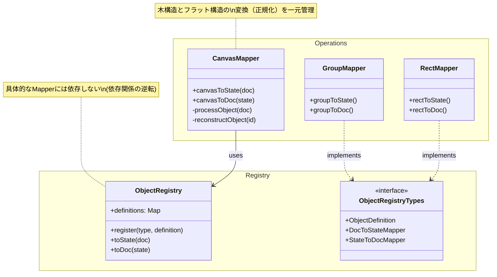

# Operations

このディレクトリには、Canvas全体および各SVGオブジェクトタイプのデータ変換ロジック（Mapper）や操作ロジックが格納されています。

## アーキテクチャと依存関係

### RegistryパターンとCanvasMapper

1.  **Registryパターン**: 個々のオブジェクト（Rect, Ellipse, Group等）の変換ロジックは、`registry` を介して疎結合に管理されます。
2.  **正規化されたCanvasState**: `CanvasState` はオブジェクトをID参照のフラットなMap（`Key-Value` 形式）として保持します。これにより、編集操作のパフォーマンスを向上させています。
3.  **CanvasMapperの責務**: 木構造の `CanvasDoc` とフラットな `CanvasState` の相互変換は、`CanvasMapper` が一元的に担います。

### 依存の方向

`operations`（具体的な実装）は `registry`（インターフェースと管理機構）に依存しますが、`registry` は具体的な実装に依存しません。

### 変換フロー

1.  **CanvasDoc (Tree) -> CanvasState (Flat)**
    - `CanvasMapper` がドキュメントツリーをトラバースします。
    - 各ノードのデータ変換は `ObjectRegistry.toState()` に委譲します。
    - 親子関係（階層構造）を `parentId` や `children` (IDリスト) に変換し、フラットな `objects` マップに登録します。

2.  **CanvasState (Flat) -> CanvasDoc (Tree)**
    - `CanvasMapper` がIDリストを元にツリーを再構築します。
    - 各ノードのデータ変換は `ObjectRegistry.toDoc()` に委譲します。
    - `children` IDリストを実際のオブジェクト配列に展開します。

### 新しいオブジェクトの追加

新しいオブジェクトタイプを追加する場合は、以下の手順で行います。

1. `operations` 配下にMapperを作成し、`ObjectRegistryTypes` の型定義に従って実装する。**再帰的な子要素の変換はMapper内では行わない**ことに注意してください。
2. アプリケーションのエントリーポイント等で、`objectRegistry.register()` を使用してMapperとComponentを登録する。
