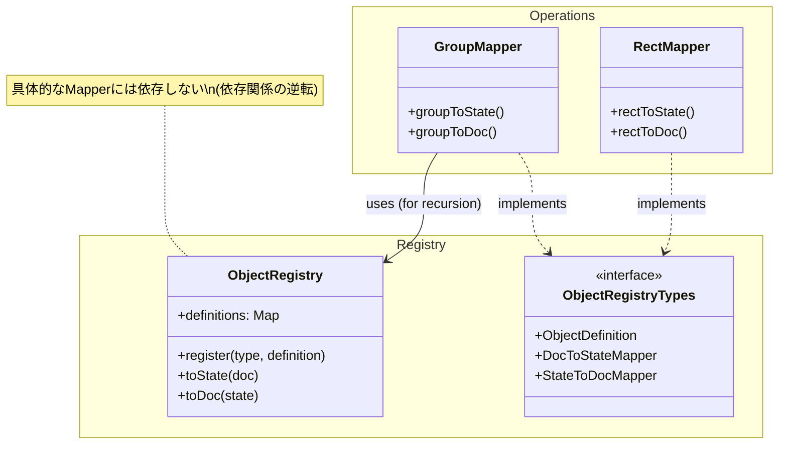

# Operations

このディレクトリには、各SVGオブジェクトタイプのデータ変換ロジック（Mapper）や操作ロジックが格納されています。

## アーキテクチャと依存関係

オブジェクト間の循環参照（例：Groupが子要素を変換するためにMapperが必要だが、その子がGroupかもしれない）を回避し、拡張性を確保するために、**Registryパターン**を採用しています。

### 依存の方向

`operations`（具体的な実装）は `registry`（インターフェースと管理機構）に依存しますが、`registry` は具体的な実装に依存しません。

### 再帰的な変換処理

Groupなどのコンテナオブジェクトは、子要素を変換する際に `ObjectRegistry.toState()` / `toDoc()` を呼び出します。これにより、具体的なMapperクラス同士が直接 `import` し合うことを防ぎ、循環参照エラーを回避しています。

### 新しいオブジェクトの追加

新しいオブジェクトタイプを追加する場合は、以下の手順で行います。
1. `operations` 配下にMapperを作成し、`ObjectRegistryTypes` の型定義に従って実装する。
2. アプリケーションのエントリーポイント等で、`objectRegistry.register()` を使用してMapperとComponentを登録する。
