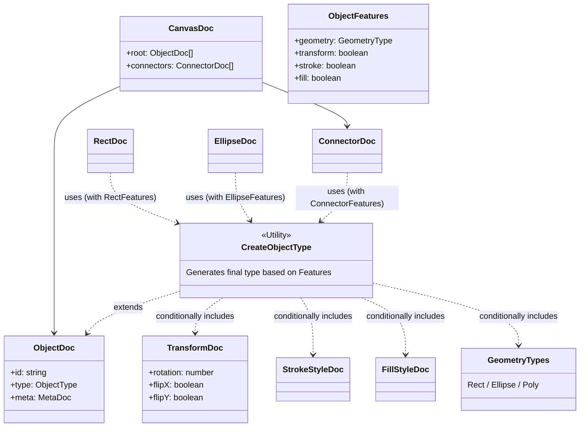

# Schemas

svg-canvas-2 のデータ構造定義（スキーマ）を管理するディレクトリです。
TypeScriptの型システムを活用し、機能フラグ（`ObjectFeatures`）に基づいてオブジェクトの型を自動合成する設計になっています。

## Directory Structure

| Directory | Description |
|Data Structure|Description|
|---|---|
| `canvas/` | キャンバス全体のルート構造 (`CanvasDoc`) を定義します。 |
| `objects/` | 個別のオブジェクト定義。`base`（共通）, `primitives`（基本図形）, `connections`（線・矢印）等に分類されます。 |
| `types/` | スキーマで使用される列挙型や共有型 (`ObjectType`, `GeometryType` 等) を定義します。 |
| `utils/` | 型定義を生成するためのユーティリティ (`CreateObjectType`) です。 |

## Type Composition Architecture

各オブジェクト（Rect, Ellipse等）は、手動ですべてのプロパティを定義するのではなく、`CreateObjectType` ユーティリティを使用して必要な機能（Geometry, Transform, Fill, Stroke）を合成して生成されます。



## Usage Example

新しいオブジェクトタイプを追加する場合：

1. `ObjectFeatures` を定義して、必要な機能を有効にします。
2. `CreateObjectType` を使って型を生成します。

```typescript
// Example: RectDoc.ts
export const RectFeatures = {
	geometry: "rect",
	transform: true,
	stroke: true,
	fill: true,
} as const satisfies ObjectFeatures;

export type RectDoc = CreateObjectType<typeof RectFeatures, { type: "rect" }>;
```
